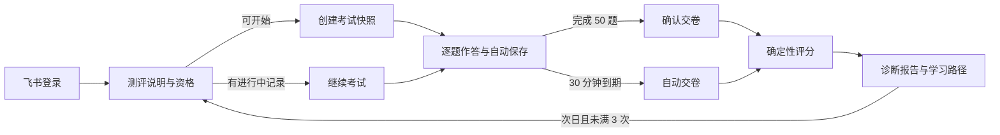
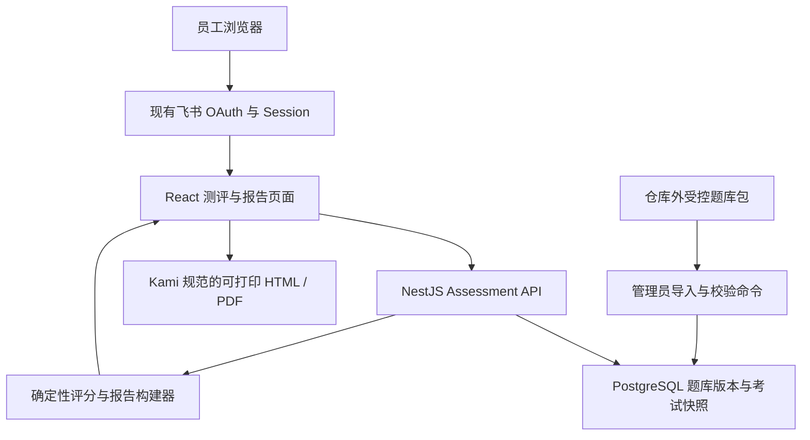

# Orosaga GEO 新人能力测评与诊断报告实施方案

> 文档状态：已实施，正式题库待人工门禁
>
> 方案版本：1.2，实施后质量审查版
>
> 编制与最近审查日期：2026-08-03
>
> Orosaga 基线：`b64471fb1b45bfe32f6d8f465c102d405c60c5f8`
>
> GEO 资料基线：`geo-citation-lab v0.1.0 / 81ba1566f70f`
>
> 目标读者：业务负责人、GEO 研究负责人、培训负责人、产品与研发团队
>
> 发布约束：正式题库继续保存在仓库外，完成人工内容复核、Angoff 定标和代表性新人试测后方可发布

## 1. 方案结论

本项目将在 Orosaga 的“新手村”增加一个受飞书登录保护的“GEO 基础能力测评”入口。员工进入后先阅读规则，再完成 50 道单选题；每题独立一页、4 个候选项、每题 2 分、总分 100 分、全卷限时 30 分钟。答题完成后立即生成可追溯的评分与多维诊断报告。

本方案采用以下默认决策：

| 决策项       | 默认值                                                   |
| ------------ | -------------------------------------------------------- |
| 正式公司名称 | 沿用系统现有名称“移山科技”                               |
| 题量与题型   | 50 道四选一单选题                                        |
| 分值         | 每题 2 分，总分 100 分                                   |
| 资料配比     | 论文主导 30 题、数据主导 10 题、业务主导 10 题，即 6:2:2 |
| 难度配比     | 基础理解 10 题、应用分析 25 题、诊断判断 15 题           |
| 限时         | 全卷 30 分钟，服务器统一计时                             |
| 通过线       | 暂按 80 分，正式发布前用专家标准设定法复核               |
| 次数规则     | 每个自然日最多开始 1 次，当前认证周期最多 3 次           |
| 计次起点     | 成功创建正式答题记录即计次；异常记录可由管理员作废       |
| 答案修改     | 最终交卷前允许返回修改，评分采用最终选择                 |
| 作答反馈     | 全卷提交前不展示答案；提交后展示完整解析                 |
| 复考性质     | 第一次记录基线，后续两次记录学习后的掌握变化             |
| 成绩口径     | 同时保留首次分、最近分、最高分；通过状态按最高分计算     |
| 报告形式     | 系统内即时诊断页 + Kami 核心报告 + 独立逐题附录          |
| UI 原则      | 完整继承 Orosaga 现有设计令牌与交互规则                  |
| 题库安全     | 正式题目、答案和解析不进入公开 Git 仓库或前端包          |

最终交付由三部分组成：

1. 一套经过来源核验、业务复核和质量审查的 50 题正式题库。
2. 一套嵌入 Orosaga 的考试、限时、计次、自动保存和评分系统。
3. 一套包含 13 张首考核心图表、复考变化图、逐题解析和学习建议的诊断报告。

### 1.1 方案成立的关键前提

本测评定位为新人培训和掌握度验证。新人先通过课程、论文、数据集和业务资料学习，再参加第一次正式测评。第一次成绩作为学习完成后的首测基线，提交后的完整解析用于针对性巩固，第二次和第三次成绩反映补学后的掌握变化。最高分可以作为培训通过口径。

固定 50 题、提交后公开答案和最高分通过，不适合直接承担高风险认证、岗位淘汰或绩效评价。若用途升级为独立认证，需要扩展到至少 90 至 120 道等价题池，每次抽取 50 题，建立平行卷难度校准，并将首次成绩或受控补考成绩作为认证口径。绩效用途仍需补充员工告知、复核、申诉和数据治理规则。

本方案按培训用途设计。用途变化会触发题库、评分、复考和报告权限的整体复审，不能只修改通过线。

## 2. 项目目标与边界

### 2.1 项目目标

本测评用于验证新人能否把 GEO 研究结论、数据判断原则和移山科技交付方法应用到真实工作场景。最终结果需要回答五个问题：

1. 新人是否理解生成式搜索、引用选择、引用吸收和可见性测量的关键概念。
2. 新人是否能判断数据能够支持哪些结论，以及哪些结论仍缺少证据。
3. 新人是否能将论文和数据转化为内容、分发、监测、归因与迭代动作。
4. 新人是否理解移山科技的客户适配、交付链路、指标体系和白帽边界。
5. 新人下一阶段应优先学习哪些知识，并通过哪些 Orosaga 页面或资料补齐。

### 2.2 核心成功标准

- 50 题均有唯一可证的标准答案。
- 每个候选项都有独立解释，错误项能够定位到明确误区。
- 每题都能追溯到论文、数据集、研究报告或经确认的业务规范。
- 答题人可以在 30 分钟内完成，阅读负担与判断难度保持平衡。
- 评分由确定性规则完成，相同答案在相同题库版本下得到相同结果。
- 报告可以解释总分、维度分、知识缺口、作答效率和优先学习路径。
- 飞书登录、权限、CSRF、审计和隐私边界复用现有 Orosaga 能力。
- 原有首页、公司、组织、系统、工作流、营地等页面视觉不发生回退。

### 2.3 本期范围

- 新手村入口与考试说明页。
- 50 题单选考试、自动保存、断线续答、服务器计时和自动交卷。
- 每日一次、每个认证周期最多三次的资格控制。
- 确定性评分、通过判断、历史成绩与逐题解析。
- 个人诊断报告、13 张首考核心图表、复考变化图和多维建议。
- 管理员查看版本、发布题库、查看个人结果、作废异常考试。
- 题库安全导入、版本冻结、来源追溯和审计记录。
- 桌面、平板、手机和打印版适配。

### 2.4 本期暂不扩展

- 主观题、问答题、语音题和人工阅卷。
- 在线监考、摄像头、屏幕录制和防作弊插件。
- 面向外部客户的公开考试。
- 部门排名、公开排行榜和绩效联动。
- 运行时大模型自由评分。
- 自动更新论文结论或直接从互联网生成新题。
- 超过 50 题的随机抽卷题库。

部门级学习分析可在个人版本稳定后增加。绩效用途需要单独确认治理规则、员工告知和申诉机制。

## 3. 现有系统理解

### 3.1 当前架构与技术栈

Orosaga 是一个 npm workspaces 单体仓库，前后端和共享协议共同版本化：

| 层级   | 当前实现                                                          | 本项目处理方式                                               |
| ------ | ----------------------------------------------------------------- | ------------------------------------------------------------ |
| Web    | React 19、TypeScript、Vite 8、React Router 7、TanStack Query、Zod | 增加懒加载测评路由和测评页面                                 |
| API    | NestJS 11、REST、Zod、Prisma 7.9 PostgreSQL Adapter               | 增加 `AssessmentModule`                                      |
| 数据库 | PostgreSQL 16、Prisma Schema、增量 Migration                      | 增加测评版本、题目、作答和报告快照表                         |
| 登录   | 飞书 OAuth、服务端 Session、CSRF、角色守卫                        | 原样复用；深链登录后回到测评页                               |
| 角色   | `EMPLOYEE`、`EDITOR`、`ASSESSMENT_MANAGER`、`ADMIN`               | 全体在职员工答题；题库管理员管理测评但不继承内容或全局管理权 |
| Worker | Node.js Worker、飞书 SDK                                          | 本期无需承担考试核心逻辑                                     |
| 部署   | Docker Compose、Nginx、私有 OSS、RDS                              | 增量部署；补充新 SPA 路由验收                                |
| 测试   | Vitest、Testing Library、Playwright、axe                          | 新增规则、API、E2E、可访问性和视觉回归测试                   |

### 3.2 当前登录能力

飞书登录已经存在并具备生产路径。测评模块只需接入现有 `AuthGate`、Session 和 CSRF 机制：

- 未登录用户打开测评深链时跳转飞书登录。
- OAuth 回调验证完成后返回原测评地址。
- 被停用员工无法新建或继续考试。
- 员工只能读取自己的考试和报告。
- 管理员访问题库发布、异常作废和结果审计接口。
- 本地开发继续使用现有受控开发登录方式，生产环境关闭绕过开关。

### 3.3 当前页面结构与入口选择

首页知识地图包含公司与业务、组织与协作、系统地图、运营工作流、新手村和同事分享。当前“新手村”是 `HomePage` 中的 `#journey` 区块，没有独立页面；`/camps` 和 `/voices` 当前承载同事分享营地。测评入口应放在首页新手村区块，避免误改同事分享页面。

入口设计采用两处露出：

1. 首页“新手村”卡片继续跳转 `#journey`，不改变六张知识地图卡片的结构。
2. `#journey` 区块增加“GEO 基础能力测评”任务行，展示未开始、进行中、已通过或需巩固状态，并链接到测评说明页。

入口只在新手村区块出现一次。考试进行中时，首页任务行显示“继续答题”和剩余时间；完成后显示最高分与报告入口。

首页资格摘要采用独立、非阻塞查询。测评接口暂时不可用时，首页其他内容照常显示，任务行退化为“进入测评查看状态”，不把测评故障扩大成知识地图首页故障。

## 4. 资料底座与证据边界

### 4.1 固定资料版本

正式题库需要固定到可复现版本：

| 资料                      | 固定版本                                                                                             | 用途                                              |
| ------------------------- | ---------------------------------------------------------------------------------------------------- | ------------------------------------------------- |
| `geo-citation-lab` 发布版 | `v0.1.0`，提交 `81ba1566f70f`                                                                        | 论文目录、实验数据、CN-GEO 数据集、报告与质量说明 |
| 论文集                    | 54 篇、10 个主题                                                                                     | 概念、方法、测量、实证、风险、架构与治理          |
| 海外跨平台实验            | 602 Prompt、21,143 条有效搜索层引用、23,745 条 citation-level 特征、18,151 个成功抓取页面、72 维特征 | 平台差异、来源选择、内容特征和引用吸收            |
| CN-GEO                    | 数据版本 2.0.1，发布日期 2026-07-14                                                                  | 国内平台、来源覆盖、跨平台共识、问题和内容特征    |
| Orosaga 业务内容          | 当前发布内容版本 + 内容哈希                                                                          | 公司定义、客户适配、交付链路、指标和白帽边界      |

资料仓库在实施时从 Orosaga 仓库外只读加载，路径通过任务专用配置 `OROSAGA_GEO_SOURCE_PATH` 提供。题库证据统一使用资料仓库内相对路径：

- `02-geo-aeo-ai-search-papers/00_资料说明/论文清单.csv`
- `01-geo-experiment-data-report/04-repet/final_report.md`
- `03-cn-geo-citation-dataset/data/数据集中文说明.md`
- `03-cn-geo-citation-dataset/data/清洗后数据使用说明.md`
- `03-cn-geo-citation-dataset/data/quality/release_date=2026-07-14/quality_report.md`

实施时从标签 `v0.1.0` 的干净检出目录读取资料，并在证据矩阵记录提交哈希与资料包 SHA-256。工作区中的未提交文件和可变分支不能作为正式答案来源。

### 4.2 证据分级与冲突处理

每条用于出题的结论先形成一张证据卡，至少记录研究问题、样本、方法、原始结论、适用范围、限制、来源定位和业务含义。证据按用途分为三级：

| 等级 | 条件                                             | 出题规则                                     |
| ---- | ------------------------------------------------ | -------------------------------------------- |
| A    | 方法、样本、结果和限制可核验，且直接支持题目判断 | 可以独立承载标准答案                         |
| B    | 结论清楚，但属于预印本、单一场景或外推范围有限   | 需要在题干中写清场景，或增加第二来源交叉支持 |
| C    | 概念讨论、综述性主张、作者观点或证据链不完整     | 只作背景和延伸阅读，不独立决定标准答案       |

论文之间出现结论差异时，按样本、平台、任务、指标和时间范围拆开判断。题目可以考察差异成立的条件；无法在题干中限定出唯一答案的结论不进入正式题库。每题发布前增加一次“反方复核”，由复核人尝试为三个干扰项建立成立条件，只要某个干扰项在题干条件下仍可成立，就回炉改写。

### 4.3 论文主题覆盖

54 篇论文按 10 个主题进入证据矩阵：

| 主题           | 论文数 | 计划主导题数 | 重点能力                       |
| -------------- | -----: | -----------: | ------------------------------ |
| GEO 基础框架   |      4 |            4 | 概念、链路、GEO 与相关方法关系 |
| GEO 方法优化   |      7 |            5 | 内容结构、意图、特征与白帽方法 |
| GEO 测量评估   |      8 |            6 | 重复测量、结构指标、选择与吸收 |
| AI 搜索实证    |      6 |            4 | 平台差异、用户行为、信源与证据 |
| AEO 理论整合   |      5 |            2 | SEO、AEO、GEO 协同边界         |
| 风险与操纵     |     10 |            4 | 投毒、排名操纵、冲突与防护     |
| 垂直与多模态   |      5 |            2 | 电商、图像、图注与 VLM 场景    |
| Agentic Search |      4 |            1 | 搜索、推理、工具调用与查询扩展 |
| RAG 检索优化   |      3 |            1 | 元数据、语义连续性与长文检索   |
| 搜索评估治理   |      2 |            1 | 评估治理、代理评判与生产约束   |
| 合计           |     54 |           30 | 论文主导题                     |

“计划主导题数”表示该主题作为题目主要证据的数量。每一篇论文都会进入证据矩阵并完成适用性判断；结论清晰、与新人工作直接相关的论文进入正式题目，其他论文作为关联阅读或二级证据。此方式可以覆盖全部资料，同时保留单题答案的确定性。

### 4.4 数据集可以支持的判断

当前数据可以直接支持：

- 信源、域名、页面和平台的覆盖分析。
- 同一问题在不同平台上的来源重合与差异。
- 页面标题、摘要、长度、结构和其他可用特征分析。
- 数据质量、字段可用性、URL 状态和重复记录判断。
- 在限定口径下的相关性、分布和静态快照比较。

当前数据不足以单独支持：

- 品牌被推荐的概率或推荐率。
- 完整回答中的品牌态度和情感倾向。
- 单次回答内的严格引用排名。
- 模型版本之间的时间趋势。
- 内容改动导致引用变化的因果结论。

题目必须明确这些边界。涉及缺失 `response_id`、完整回答、模型版本、统一采集时间的场景时，正确答案应体现数据可用范围和补采要求。

10 道数据主导题还需保存可复现查询信息：`evidenceQueryId`、数据表、过滤条件、去重口径、统计分母、预期结果和结果哈希。查询优先基于发布版 DuckDB 或 Parquet 生成，并由第二位复核人独立运行。题目不要求新人记忆大段精确数字，数值用于口径辨析、方向判断和业务解释。

### 4.5 业务证据如何冻结

业务题以经负责人确认的业务规范快照为依据。快照记录 Orosaga `ContentPage` 的内容修订 ID、工作流版本、关键规范摘要、确认人、确认时间和 SHA-256，不直接绑定会继续变化的页面正文。

- 当前内容发布后发生变化时，系统将题库版本的 `sourceReviewStatus` 标为 `REVIEW_REQUIRED`。
- `REVIEW_REQUIRED` 保留题库主发布状态，同时暂停新建考试；已经开始的考试和历史报告仍按原快照结算。首页入口显示“内容复核中”，员工可以查看历史结果，不能消耗新的考试资格。
- 内容负责人需要判断变化是否影响标准答案。无影响时记录复核结论并恢复 `CURRENT`；有影响时退役旧版本、发布新题库版本后再恢复新建考试。
- 题库每 6 个月做一次来源复核；业务规则、数据版本或核心论文结论发生重大变化时提前复核。

### 4.6 版权、许可与引用规则

- 题干和解析采用原创转述，不长段复制论文正文。
- 每题保存论文题名、来源 URL、本地文件、页码或章节定位。
- 论文 PDF 继续遵守作者和出版方的原始权利声明。
- 代码、报告、目录元数据和 CN-GEO 数据分别遵循仓库声明的许可。
- 对内部业务规范只记录经负责人确认的版本与摘要，不把敏感交付细节写入公开仓库。

## 5. 能力模型与 50 题蓝图

### 5.1 五个诊断维度

每个维度分配 10 题、满分 20 分，确保维度间可以直接比较：

| 维度                    | 诊断问题                                             | 典型误区                             |
| ----------------------- | ---------------------------------------------------- | ------------------------------------ |
| D1 GEO 基础与搜索链路   | 是否理解触发搜索、选择来源、吸收内容、生成答案的关系 | 把引用、排名、推荐和吸收视为同一指标 |
| D2 内容策略与引用竞争   | 是否能把意图、证据、结构、权威和平台差异转成内容动作 | 追求单一格式、字数或关键词密度       |
| D3 测量与数据判断       | 是否会读字段、定口径、识别缺失、区分相关与因果       | 用静态引用数据推导推荐率和趋势       |
| D4 业务诊断与交付       | 是否能完成诊断、方案、实施、监测、归因和迭代         | 直接做内容，跳过目标问题和基线诊断   |
| D5 风险、治理与白帽边界 | 是否识别操纵、投毒、知识冲突、合规和审计风险         | 把短期曝光提升作为唯一成功标准       |

### 5.2 6:2:2 与能力维度交叉矩阵

| 主要证据来源 |  D1 |  D2 |  D3 |  D4 |  D5 | 合计 |
| ------------ | --: | --: | --: | --: | --: | ---: |
| 论文主导     |   7 |   8 |   8 |   2 |   5 |   30 |
| 数据主导     |   1 |   1 |   2 |   4 |   2 |   10 |
| 业务主导     |   2 |   1 |   0 |   4 |   3 |   10 |
| 合计         |  10 |  10 |  10 |  10 |  10 |   50 |

每题只有一个主要证据来源和一个主诊断维度，同时可以带多个辅助主题标签。报告按主维度计分，辅助标签用于解释误区和推荐学习材料，避免同一道题被重复加分。

业务交付阶段属于辅助标签，可以一题多标。诊断、方案、实施、监测、归因、迭代和治理每个阶段至少关联 4 题，阶段图只做工作场景诊断，不重复计入总分。

### 5.3 难度与认知层级

| 层级        | 数量 | 目标                             | 建议题干形态                   |
| ----------- | ---: | -------------------------------- | ------------------------------ |
| L1 基础理解 |   10 | 理解概念和边界                   | 简短案例、定义辨析、指标含义   |
| L2 应用分析 |   25 | 将研究结论用于内容、数据和交付   | 客户场景、数据表、方案选择     |
| L3 诊断判断 |   15 | 在证据冲突、缺失和风险下作出判断 | 复杂场景、最优下一步、治理取舍 |

至少 30 道题使用业务或研究场景。纯记忆题控制在 5 道以内。所有题目应在不查资料时具备清晰判断路径，避免冷僻作者、会议名称和年份记忆。

### 5.4 考试时长预算

30 分钟完成 50 题，平均每题 36 秒。题目设计按以下阅读预算控制：

- 题干通常为 60 至 150 个汉字，复杂数据场景最多 220 个汉字。
- 每个选项通常为 15 至 45 个汉字，四项保持相近长度和语法结构。
- 单题只承担一个主判断，不叠加多段计算。
- 数值题只使用能快速完成的比例、口径或方向判断。
- 页面顶部显示总剩余时间和当前进度，不设置逐题强制倒计时。
- 预试目标是整卷中位完成时间 22 至 26 分钟、至少 90% 的参与者在截止前完成 50 题、已完成者 P90 不超过 29 分钟，给交卷检查和偶发网络重试保留空间。
- 单题中位时间建议为 24 至 32 秒；个别复杂题可以达到 50 秒，但同一份试卷最多安排 5 道此类题。

### 5.5 通过线需要经过标准设定

80 分是便于方案讨论的暂定值，正式发布前采用简化的修订 Angoff 方法复核。至少 3 位熟悉新人胜任标准的研究或业务专家，分别判断“刚达到岗位基础要求的新人”答对每题的概率，汇总后得到建议通过线。

- 建议线落在 76 至 84 分时，可结合培训政策取整为 80 分，并保留记录。
- 建议线明显偏离该区间时，优先检查题目难度、课程覆盖和胜任标准，再由业务负责人确认新通过线。
- 通过线、专家名单、评分记录和确认理由进入题库版本元数据。
- 维度阈值用于诊断，不单独决定通过状态。

## 6. 高质量题目设计规范

### 6.1 每题的完整内容结构

正式题目需要保存以下信息：

| 字段组     | 必填内容                                                           | 用途               |
| ---------- | ------------------------------------------------------------------ | ------------------ |
| 身份与版本 | 题号、稳定 ID、题库版本、状态                                      | 冻结考试与追溯变更 |
| 题目蓝图   | 主维度、辅助标签、来源配比、难度、认知层级、业务重要度             | 覆盖率和诊断聚合   |
| 题面       | 场景、题干、4 个带稳定 ID 的选项                                   | 员工作答           |
| 标准答案   | 正确选项 ID、简明结论、完整推理链                                  | 确定性评分和解析   |
| 选项解析   | 每项成立或不成立的原因、边界、误区代码                             | 逐题诊断           |
| 工作应用   | 对移山交付动作、指标或治理的启示                                   | 连接真实业务       |
| 证据       | 来源类型、证据等级、题名、版本、URL、相对路径、页码或章节、查询 ID | 人工复核与审计     |
| 推荐学习   | Orosaga 页面、论文、报告章节、建议练习                             | 报告生成学习路径   |
| 质量信息   | 编写人、研究复核人、业务复核人、更新时间、内容哈希                 | 发布门禁           |

### 6.2 四个选项的设计角色

每题四项建议承担四种不同判断角色，具体顺序在考试中随机：

1. **标准答案**：覆盖题干全部条件，结论与证据边界一致。
2. **局部正确项**：包含真实概念，但遗漏关键条件、范围或测量口径。
3. **常见经验项**：符合传统 SEO 或直觉经验，在 GEO 场景中证据不足。
4. **业务捷径项**：看起来高效，实际会跳过诊断、归因、质量或合规步骤。

错误项需要“有吸引力且可诊断”。每个错误项都必须对应一个能够被解释和改进的认知偏差，不能依靠含糊措辞、冷知识或文字陷阱制造难度。

### 6.3 选项质量门禁

每题发布前逐项检查：

- 四个选项处于同一语义层级，均能直接回答题干。
- 正确项没有明显更长、更精确或更专业的语言提示。
- 错误项含有合理前提，错误点集中在一个可解释的关键差异。
- 不使用“以上全部”“以上都不对”或多个答案组合。
- 尽量使用肯定式题干；确需问“最不适合”时突出否定词并复核误读风险。
- 不使用绝对词暗示答案，如“永远”“唯一”“完全必然”。
- 不用模糊频率词承担关键差异，如“通常”“经常”“一般”而无口径。
- 不引用超过必要长度的论文原文。
- 不把公司口号直接做成可凭语气识别的答案。
- 正确项在固定证据版本下具有唯一性。
- 选项 ID 在同一题内唯一，标准答案 ID 必须存在于四个选项中。
- 三个错误项各自至少绑定一个误区代码；正确项不得绑定错误误区。
- 题干、选项、正确答案、逐项解析和来源定位经过 Schema 校验后才可进入人工复核。

### 6.4 错误项与误区编码

建议建立统一误区词典，供报告聚合：

| 误区代码              | 含义                                   | 对应建议方向             |
| --------------------- | -------------------------------------- | ------------------------ |
| `M-METRIC-CONFLATION` | 混淆引用数、影响力、推荐率、排名       | 学习指标定义与测量层级   |
| `M-CAUSAL-OVERREACH`  | 从相关或静态快照推导因果               | 学习实验设计与因果边界   |
| `M-MISSING-DATA`      | 忽略回答边界、模型版本、采集时间等缺失 | 学习数据质量与补采方案   |
| `M-PLATFORM-FLAT`     | 把不同平台的检索和吸收机制视作相同     | 学习平台差异与分发策略   |
| `M-FORMAT-SHORTCUT`   | 把字数、Q&A 或关键词当作单一充分条件   | 学习相关性、证据块与结构 |
| `M-AUTHORITY-ONLY`    | 只看域名权威，忽略对题性和内容可抽取性 | 学习候选池与吸收深度     |
| `M-DELIVERY-SKIP`     | 跳过诊断、基线、监测或归因环节         | 学习完整交付闭环         |
| `M-BUSINESS-MISMATCH` | 客户目标、内容动作和成功指标不匹配     | 学习客户适配与目标拆解   |
| `M-RISK-BLIND`        | 忽略操纵、投毒、冲突、版权或合规风险   | 学习白帽与治理边界       |
| `M-LOCAL-GLOBAL`      | 将海外实验直接外推到国内全部平台       | 学习样本范围和本地验证   |

误区词典允许后续增加，不允许发布后改变已冻结题目的历史含义。新词典版本只影响新题库或新报告版本。

### 6.5 标准答案与解析写法

每道题的完整解析采用固定六段：

1. **标准答案**：明确给出选项文本。
2. **核心判断**：用 1 至 2 句话说明决定答案的关键条件。
3. **推理路径**：从题干事实到结论分 2 至 4 步展开。
4. **逐项解释**：分别解释 A、B、C、D，指出错误项成立的局部条件和当前不成立之处。
5. **业务应用**：说明在移山科技诊断、内容、监测、归因或治理工作中的动作。
6. **证据定位**：列出论文、数据表、报告章节或业务规范版本。

解析文案需要让新人知道“下一次遇到同类问题时怎样判断”。每项解析建议 60 至 160 个汉字，完整单题解析建议 400 至 800 个汉字。

### 6.6 题目制作流程

1. 建立 54 篇论文证据矩阵，提取研究问题、样本、方法、结论、限制和业务含义。
2. 建立两套数据证据卡：海外实验、CN-GEO；每个结论同时记录计算口径和不可用边界。
3. 建立移山业务规范卡：客户适配、七系统与 Agent 协同、交付六阶段、核心指标、白帽规则。
4. 依据 50 题蓝图分配题位，先确定“测什么”和“依据什么”。
5. 编写题干和标准答案，再为三类典型误区编写干扰项。
6. 完成逐项解析、工作应用、来源定位和推荐学习材料。
7. 进行研究复核、业务复核、题目质量复核和版权复核。
8. 用小规模预试验证阅读时间、歧义、难度和干扰项吸引力。
9. 用修订 Angoff 方法复核通过线，并记录专家判断。
10. 修订后生成题库版本、内容哈希和只读发布包。
11. 发布后只记录质量数据；任何题目调整都创建新版本。

### 6.7 复核角色

| 角色           | 重点责任                           | 发布签字条件             |
| -------------- | ---------------------------------- | ------------------------ |
| 研究复核人     | 论文结论、数据口径、来源定位       | 证据与结论一致，限制明确 |
| 业务复核人     | 移山场景、流程、指标和白帽边界     | 与当前业务规范一致       |
| 题目质量复核人 | 唯一答案、干扰项、语言、难度和时长 | 无提示性线索与歧义       |
| 技术发布人     | Schema、版本、哈希、答案安全       | 导入校验和安全门禁通过   |

同一人可以承担多个角色，但研究证据和业务判断至少需要两人交叉确认。

### 6.8 预试与题目校准

内容预试安排 8 至 12 名未参与出题的代表性人员，至少包含 2 名业务熟练者和 6 名接近新人水平的参与者。预试人员如果属于正式培训对象，其预试成绩不进入新人基线统计，正式开放前应更换被其看过且已公开解析的题目。

首发门禁关注：整卷完成时间、题干歧义、双重答案、错误项是否有人选择、受试者能否复述判断依据。累计达到 30 份独立首考后，再观察单题正确率、错误选项选择率和点二列相关；错误项选择率长期低于 5% 或区分度低于 0.15 的题目进入复核。样本不足时不以统计阈值替代人工判断。

## 7. 三道示范题

以下示例用于确认题目水平、选项逻辑和解析深度，示例题不会进入正式 V1 题库，避免公开方案文件提前泄露正式答案。正式 50 题会在方案确认后的内容制作阶段完成，并经过固定来源复核。

### 示例 1：数据边界判断

**维度**：D3 测量与数据判断；**难度**：L2 应用分析；**主要证据**：CN-GEO 数据版本 2.0.1

**题干**

团队希望用当前 CN-GEO 数据评估某品牌在国内 AI 平台中的表现。已知数据保存了问题、平台和外部引用，但缺少完整回答、可靠回答批次、模型版本与统一采集时间。以下哪项结论最适合直接产出？

A. 该品牌在每个平台被推荐的概率及其季度变化<br>
B. 该品牌相关域名覆盖了哪些问题与平台，以及仍有哪些覆盖空白<br>
C. 该品牌在完整回答中的正负面情感比例<br>
D. 该品牌在每次回答中的严格引用排名和平均名次

**标准答案：B**

**核心判断**

当前记录可以连接问题、平台和引用来源，适合做来源覆盖与跨平台差异。推荐率、情感、单次回答排名和趋势均依赖当前缺失的回答级数据。

**逐项解释**

- A：需要分母、完整回答、回答批次、模型版本和时间序列。当前静态引用记录无法给出可靠推荐概率与季度变化。误区：`M-MISSING-DATA`、`M-CAUSAL-OVERREACH`。
- B：问题、平台、域名和页面是当前数据的稳定连接关系，可以计算覆盖、重合与空白。该结论与数据粒度一致。
- C：引用摘要不能代表完整回答语义，也不能代表模型对品牌的态度。误区：`M-METRIC-CONFLATION`。
- D：`response_id` 为空且回答边界不可靠，`quote_index` 不能直接恢复每次完整回答内的严格顺序。误区：`M-MISSING-DATA`。

**业务应用**

客户诊断首版可以交付“问题、平台、信源覆盖图”和内容机会清单；推荐率、情感和趋势应进入补采计划，明确所需字段与重复采集周期。

**证据定位**

- `03-cn-geo-citation-dataset/data/数据集中文说明.md`：数据记录、适用分析与使用边界。
- `03-cn-geo-citation-dataset/data/清洗后数据使用说明.md`：`response_id`、回答边界和字段可用性。

### 示例 2：平台策略判断

**维度**：D2 内容策略与引用竞争；**难度**：L3 诊断判断；**主要证据**：海外跨平台实验

**题干**

同一组问题中，某平台平均引用来源较多，另一个平台的单条引用平均影响力更高。团队准备制定统一内容策略。以下哪项行动最稳妥？

A. 只优化平均引用来源最多的平台，因为引用宽度可以代表最终影响力<br>
B. 所有平台使用完全相同的内容和分发组合，避免结果口径变化<br>
C. 分开测量“进入候选来源”与“被答案吸收”，再按平台设计覆盖型和深度型内容<br>
D. 只提升页面字数，长度达到阈值后平台差异可以忽略

**标准答案：C**

**核心判断**

来源选择和内容吸收属于两个测量层级。平台在检索宽度和单条来源影响力上可能呈现不同模式，策略需要分别建立指标和内容动作。

**逐项解释**

- A：引用来源数量反映检索或选择宽度，不能直接替代答案中的吸收深度。误区：`M-METRIC-CONFLATION`。
- B：统一素材有利于控制变量，但长期分发与结构策略仍需响应平台差异。该选项把实验控制方式扩展成固定经营策略。误区：`M-PLATFORM-FLAT`。
- C：先区分候选池与吸收，再用分平台实验验证内容和分发，符合研究链路和业务归因要求。
- D：长度与影响力存在关联，相关性不能推出单一充分条件；对题性、结构、来源和平台机制仍然重要。误区：`M-FORMAT-SHORTCUT`。

**业务应用**

诊断报告应把“可见 / 被引”和“被深度采用”分开展示。交付方案可以为广覆盖平台强化子问题覆盖，为深吸收平台强化定义、证据、对比和背景整合，同时保留统一基线用于比较。

**证据定位**

- `01-geo-experiment-data-report/04-repet/final_report.md`：平台引用宽度与 citation-level 影响力。
- 论文《From Citation Selection to Citation Absorption》：来源选择与吸收的测量框架。

### 示例 3：白帽业务边界

**维度**：D5 风险、治理与白帽边界；**难度**：L3 诊断判断；**主要证据**：风险论文 + 移山业务规范

**题干**

客户要求团队批量发布带有隐蔽指令和夸大事实的页面，希望短期提高某商品在生成式搜索中的出现频率。项目负责人应如何处理？

A. 先小规模执行，只要曝光提升且没有用户投诉即可扩量<br>
B. 拒绝操纵性方案，改为可核验事实、清晰来源、结构化证据和持续测量<br>
C. 保留夸大表述，删除隐蔽指令即可满足白帽要求<br>
D. 将内容分发到更多第三方站点，以来源数量分散风险

**标准答案：B**

**核心判断**

隐蔽指令、虚假或夸大事实会引入操纵、知识冲突、品牌信任和平台治理风险。白帽交付需要事实可核验、来源可追溯、方法可审计，并用持续实验优化内容价值。

**逐项解释**

- A：小规模不会改变行为性质，短期曝光也不能覆盖长期治理和信任风险。误区：`M-RISK-BLIND`。
- B：同时满足真实性、来源、结构、测量和可审计要求，是符合业务边界的处理方式。
- C：夸大事实本身已经违反真实性与信任要求。删除一种技术手段不能消除内容风险。误区：`M-RISK-BLIND`。
- D：增加分发面会扩大错误信息影响范围，来源数量也不会降低操纵责任。误区：`M-AUTHORITY-ONLY`、`M-RISK-BLIND`。

**业务应用**

项目立项和内容验收需要设置白帽检查项：事实来源、主张强度、证据日期、利益相关关系、内容责任人和变更记录。高风险需求进入负责人复核并留存审计记录。

**证据定位**

- 论文集“风险与操纵”主题：排名操纵、检索投毒、知识冲突与对抗攻击。
- Orosaga 公司业务内容：白帽 GEO 边界与可信交付原则。

## 8. 考试规则与用户流程

### 8.1 说明页文案信息

说明页应简洁说明：

- 目的：检验 GEO 基础、数据判断和业务应用能力。
- 题型：50 道单选题，每题 4 个选项，每题 2 分。
- 时间：开始后 30 分钟内完成，关闭页面不会暂停计时。
- 操作：选择后点击“保存并进入下一题”；最终交卷前可以返回修改。
- 反馈：全卷提交后展示答案、解析、图表和学习建议。
- 次数：每天最多开始 1 次，当前认证周期最多 3 次。
- 恢复：同一次考试可在时限内重新进入并继续。
- 超时：到达截止时间自动交卷，未答题计 0 分。
- 成绩：保留首次、最近和最高成绩，暂按 80 分通过，正式线以题库发布记录为准。
- 异常：系统故障由管理员核验后作废，不占正式次数。

“开始考试”按钮需要二次确认，并明确提示“确认后立即开始 30 分钟计时，同时占用当天和本周期一次资格”。资格创建成功后才进入第一题；请求失败时不占次数。

### 8.2 页面流程



### 8.3 单题交互

- 每题拥有独立 URL，例如 `/assessment/geo-foundations/attempt/:attemptId/question/:position`。
- 页面复用一个 `QuestionPage` 组件；不会创建 50 个重复页面组件。
- 顶部显示题号、总进度、剩余时间和自动保存状态。
- 中部展示场景、题干和四个可键盘操作的单选项。
- 底部提供“上一题”和“保存并进入下一题”。首次经过某题时需要选择后再前进。
- 答案成功写入服务端后进入下一题；在最终交卷前可以返回并修改，评分采用最后一次成功保存的选择。
- 交卷确认页展示 50 题完成状态，允许点击题号返回检查，不展示正误。
- 网络失败时保留当前选择并显示重试，避免静默丢失。
- 刷新页面后从服务端恢复最后已保存题目、当前位置和剩余时间。
- 最后一题按钮改为“保存并检查”，进入交卷确认页。
- 提交前只显示已答数量，不展示正确性和解释。
- 浏览器返回、刷新和退出页面都不暂停计时；主动离开考试时显示一次明确提示。
- 前端可以预取下一题题面以降低等待时间，不能预取答案、解析或其他员工数据。

答案更新带整数版本号。多设备同时修改同一道题时，后提交的客户端若携带旧版本会收到冲突响应，并展示服务端最新答案，由员工确认后再覆盖，避免静默丢失。

### 8.4 题目与选项随机化

- 每次考试创建不可变题目快照。
- 50 题在维度和难度约束下随机排序。
- 四个选项独立随机排序，保存显示顺序。
- 答案以稳定选项 ID 判断，不以 A/B/C/D 字母判断。
- 报告展示本次实际看到的顺序，同时标识标准答案。
- 考试快照只保存题目 ID、题目顺序、选项顺序和题库版本，不包含标准答案或完整解析。
- 历史考试在数据保留期内始终使用原快照，后续题库发布不改变历史结果。

### 8.5 次数和日期规则

- “一天”按服务端 `Asia/Shanghai` 自然日计算，资格日期取考试开始时间。
- 成功创建 `IN_PROGRESS` 考试即占用当天资格和一次总次数。
- 关闭浏览器、切换设备或网络中断不会新建考试，用户只能继续当前记录。
- 30 分钟从服务端 `startedAt` 连续计算，离开页面期间继续计时。
- 任意日期仍有 `IN_PROGRESS` 且未到期的考试时，禁止创建第二条考试。
- 同一用户、同一测评在同一天最多存在一条未作废考试。
- 总次数按认证周期统计未作废考试，最多 3 条。普通题目修订和题库小版本发布不会重置次数。
- 只有业务负责人明确创建新的认证周期时，员工才重新获得该周期的 3 次资格。
- 已通过员工在当前周期仍可使用剩余次数复考；第 3 次仍未通过时进入“需要辅导”状态，不自动开放第 4 次。
- 管理员作废必须填写原因，并写入审计日志；作废后可按规则重新开始。
- 客户端时间不参与资格判断，防止修改本地时钟绕过规则。

自然日规则允许员工在午夜前完成一次考试，并在午夜后开始下一次，前提是前一条考试已经终结。该行为符合“每天一次”的字面规则；如果培训政策要求学习间隔，后续可以在认证周期配置中增加最短间隔，本期不默认增加。

### 8.6 考试状态

| 状态          | 含义                     | 可执行动作             |
| ------------- | ------------------------ | ---------------------- |
| `IN_PROGRESS` | 已开始，仍在截止时间内   | 继续、保存答案、提交   |
| `SUBMITTED`   | 主动完成交卷             | 查看报告               |
| `EXPIRED`     | 截止时间到达并结算       | 查看报告，未答计 0     |
| `VOID`        | 管理员确认系统异常后作废 | 不计次数；查看作废说明 |

`SUBMITTED` 和 `EXPIRED` 都是终态。超时结算由 API 在读取资格、考试或报告时执行；系统无需依赖浏览器持续在线。到期后答案写入接口拒绝更新，交卷接口仍可幂等地结算截止前已经保存的答案。若后续需要主动通知，可再由 Worker 扫描过期记录。

提交、超时和管理员作废都会锁定考试行，第一条成功的终态转换生效。重复交卷返回同一成绩，作废后的报告保留只读记录并醒目标注“本次不计入成绩”。

## 9. 评分与诊断逻辑

### 9.1 基础评分

- 正确答案：2 分。
- 错误答案：0 分。
- 未作答：0 分。
- 总分：50 题得分之和，范围 0 至 100。
- 通过：最高有效成绩达到题库版本记录的通过线；V1 暂按 80 分设计，发布前完成标准设定。
- 维度分：该维度 10 题得分之和，范围 0 至 20，同时换算为百分制。
- 来源分：论文主导、数据主导、业务主导分别统计正确率。
- 难度分：L1、L2、L3 分别统计正确率。

评分只读取最终成功保存的选项。答题时长、返回修改次数、切换设备和页面可见状态都不影响得分与通过结果。

### 9.2 诊断分层

|  维度正确率 | 状态     | 报告语言                       | 建议强度 |
| ----------: | -------- | ------------------------------ | -------- |
| 80% 至 100% | 稳定掌握 | 能够应用，提醒边界与进阶方向   | 低       |
|  60% 至 79% | 需要巩固 | 指出具体误区与对应学习材料     | 中       |
|   0% 至 59% | 优先补齐 | 给出概念、案例、练习和复考建议 | 高       |

维度只有 10 题，报告需要同时展示题数，避免将小样本差异写成精确能力定论。单题错误用于提示知识缺口，连续多个同类误区才升级为强建议。

### 9.3 学习优先级

每个知识点根据三项信息排序：

- 掌握缺口：该标签下的错误比例。
- 业务影响：题库预先标注 1 至 5 级业务重要度。
- 证据可信度：该标签下有效题目数量、来源等级和样本分母。

优先级规则保持确定性，结果可复算。只有同一标签至少覆盖 2 题时，系统才生成“知识点缺口”判断；单题错误进入逐题提醒，不上升为稳定能力结论。报告给出 3 个最高优先级动作和 3 至 5 个巩固动作，每个动作包含原因、证据、学习材料、工作练习和完成标准。

### 9.4 时间与修改行为只作辅助信号

30 分钟考试时限完全由服务端 `deadlineAt` 决定。单题用时由前端使用单调时钟统计，只累计页面可见且窗口获得焦点的时间，切到后台时暂停单题活跃计时，整卷倒计时继续运行。

- 单题活跃时间和答案修改次数用于个人节奏分析，不参与评分。
- 客户端上报值需要做范围校验和上限截断，不作为权限、资格或审计依据。
- 在同题首考样本少于 30 份时，“快 / 慢”暂以设计目标 36 秒为参考，并标注为暂定。
- 样本达到 30 份后，按同题首考中位时间与离散范围解释，避免复杂题天然耗时较长造成误判。
- 返回修改可以表示认真复核，也可能表示犹豫。报告只写“发生修改”，不把它直接解释为信心不足。

### 9.5 多次考试解释

由于第一次提交后会展示完整答案，后续考试反映学习和记忆后的掌握变化。报告需并列展示：

- 首次成绩：新人完成规定学习后的首测基线。
- 最近成绩：当前状态。
- 最高成绩：培训通过口径。
- 维度变化：哪些能力提升、保持或回落。
- 重复错误：多次仍选择相同误区的题目。

若未来需要独立验证迁移能力，应扩展同知识点的等价题库，并从题池抽取。本期固定 50 题更适合培训闭环。

## 10. 诊断报告方案

### 10.1 报告层级

报告分为四层：

1. **结论层**：分数、是否通过、考试次数、用时和前三项建议。
2. **结构层**：维度、来源、难度、主题、业务阶段和误区图表。
3. **行动层**：个性化学习路径、工作练习、复考计划和完成标准。
4. **证据层**：50 题逐题答案、逐项解析、来源和业务应用。

报告分成两个可独立阅读的输出：

- **核心诊断报告**：建议控制在 12 至 16 页 A4，包含结论、13 张核心图表、优先建议和学习路线。
- **逐题解析附录**：单独生成，预计 30 至 50 页，包含 50 题完整选项解析和来源。系统内继续用折叠列表阅读，员工按需打印。

拆分后，核心报告适合快速沟通，完整证据仍然保留。打印按钮分别提供“打印核心报告”和“打印逐题附录”。

### 10.2 13 张核心图表

首次考试生成 13 张图表。总分、通过状态、考试次数和总用时使用指标卡展示，不计入图表数量。每张图只回答一个诊断问题，图旁同时显示分母和一句结论。

|   # | 图表          | 形式       | 数据                                             | 诊断价值                       |
| --: | ------------- | ---------- | ------------------------------------------------ | ------------------------------ |
|   1 | 作答结果构成  | 环形图     | 正确、错误、未答                                 | 区分知识错误与时间不足         |
|   2 | 五维得分构成  | 瀑布图     | 5 个维度对总分的贡献                             | 解释总分来自哪些能力           |
|   3 | 五维掌握度    | 横向柱状图 | 每维正确率与 80% 诊断参考线                      | 找到优势和短板                 |
|   4 | 证据来源表现  | 分组柱状图 | 论文、数据、业务的正确与错误                     | 判断知识来源偏科               |
|   5 | 难度表现      | 分组柱状图 | L1、L2、L3 正确率                                | 区分理解、应用和诊断能力       |
|   6 | 十个论文主题  | 横向柱状图 | 主题正确率与题数                                 | 定位研究主题缺口               |
|   7 | 业务交付阶段  | 横向柱状图 | 诊断、方案、实施、监测、归因、迭代、治理         | 对齐实际工作流程               |
|   8 | 主要误区分布  | 横向柱状图 | 误区代码出现次数                                 | 解释错误的共同原因             |
|   9 | 单题耗时分布  | 柱状直方图 | 0 至 15、16 至 30、31 至 45、46 至 60、60 秒以上 | 识别阅读和决策节奏             |
|  10 | 正确性 × 耗时 | 四象限图   | 每题正确性、活跃时间、难度                       | 识别熟练作答、快速误判和耗时题 |
|  11 | 五题一组节奏  | 折线图     | 每 5 题累计用时与设计节奏                        | 识别前慢后赶或后程停滞         |
|  12 | 答案修改分布  | 柱状图     | 未修改、修改 1 次、修改 2 次以上                 | 展示复核行为，不推断心理状态   |
|  13 | 学习优先级    | 四象限图   | 掌握缺口、业务影响、知识标签                     | 形成下一步行动顺序             |

多次考试增加两张变化图：

|   # | 图表         | 形式       | 使用条件            |
| --: | ------------ | ---------- | ------------------- |
|  14 | 历次成绩趋势 | 折线图     | 2 次或 3 次有效考试 |
|  15 | 五维前后变化 | 分组柱状图 | 至少 2 次有效考试   |

论文主题题数不均时，图表同时显示分母。例如“治理 1/1”只表示该题答对，报告不会扩展成完整治理能力结论。任何图表在数据不足时都要显示“样本较少”的说明，不能用装饰性图形制造精确感。

### 10.3 图表实现与 Kami 使用方式

Kami 在本项目中承担报告信息设计、长文排版、图表选择和打印质量规范。Orosaga 的运行时保持自身技术栈，不调用本地 skill，也不要求每次考试启动智能体。

实施方式：

1. API 生成稳定的 `AssessmentReportPayload`，包含分数、维度、误区、耗时、建议和逐题解析。
2. Web 报告页使用 React 与内联 SVG 渲染图表，支持即时查看、键盘访问和响应式布局。
3. 实施阶段用 Kami 的 long-doc、bar、line、donut、quadrant、waterfall 规范设计可打印模板。
4. Kami 的颜色与字体通过项目视觉扫描映射到 Orosaga：暖纸 `#f6f7f3`、深山绿 `#173d37`、主绿 `#3e7a69`、陶土橙 `#d68464`，中文标题使用 `Noto Serif SC`，正文使用 `Noto Sans SC`。
5. 打印路由使用同一报告数据快照生成 A4 长报告，浏览器可直接“打印 / 保存为 PDF”。
6. 图表采用共享 SVG 原语，不新增重量级图表依赖；每张图都有文本摘要、数据表或可访问标签。
7. 报告模板一经发布按版本冻结，历史报告不会因后续样式或算法变化而改变结论。

这条路径可以同时满足 Kami 的诊断报告质量和 Orosaga 的现有 UI 规则。系统内页面保持“安静、清晰、可长期使用的山中工作地图”气质；打印版延续同一品牌视觉。

### 10.4 个性化建议结构

每条建议采用以下结构：

- **发现**：哪个维度、主题或误区出现问题。
- **证据**：相关题数、错误数、用时和代表题目。
- **含义**：该缺口可能影响哪类工作判断。
- **学习材料**：Orosaga 页面、论文或数据说明的精确入口。
- **工作练习**：一个可以在真实项目中完成的小任务。
- **完成标准**：可核验产物或复盘问题。
- **复考建议**：建议复考日期和重点检查项。

示例建议：

> 数据边界是当前最高优先级。你在 4 道“回答级数据缺失”相关题中答错 3 道，其中 2 次把引用记录解释为品牌推荐率。建议先阅读 CN-GEO 数据使用边界，完成一份“现有字段、可回答问题、补采字段”三列表，再复盘客户报告中的推荐率口径。完成标准是能为推荐率、趋势和引用排名分别写出分母、回答边界、模型版本与采集时间要求。

### 10.5 逐题报告

每题展示：

- 题号、维度、难度和主要来源。
- 用户本次选择与标准答案。
- 正确或错误状态、单题用时。
- 核心判断与推理路径。
- 四个选项的独立解析。
- 本次错误对应的误区标签。
- 移山业务应用建议。
- 精确来源和推荐学习链接。

逐题部分默认折叠，支持按“只看错题、只看未答、按维度、按误区”筛选。打印版将逐题解析放入报告附录。

## 11. UI 与页面设计

### 11.1 视觉继承规则

测评页面严格复用 Orosaga 当前规则：

- 颜色：`#171b19` 主文字、`#69716c` 次级文字、`#f6f7f3` 纸面、`#173d37` 深山绿、`#3e7a69` 主绿、`#d68464` 陶土橙、`#2167eb` 键盘焦点。
- 字体：`Noto Sans SC` 正文与控件、`Noto Serif SC` 中文标题、`DM Serif Display` 数字与英文标签。
- 宽度：标准内容区 1180px；答题正文建议控制在 760 至 860px。
- 圆角：标签 4px、控件 6 至 7px、卡片与浮层不超过 8px。
- 布局：连续平面、薄边线、少阴影、无嵌套卡片。
- 动效：160 至 220ms，提供 `prefers-reduced-motion`。
- 响应式：980px 和 680px 两级断点，最低支持 320px。
- 图标：继续使用 Lucide 线性图标。

### 11.2 页面清单

| 路由                                                          | 页面           | 核心内容                             |
| ------------------------------------------------------------- | -------------- | ------------------------------------ |
| `/assessment/geo-foundations`                                 | 测评说明与资格 | 规则、剩余次数、历史结果、开始或继续 |
| `/assessment/geo-foundations/attempt/:id/question/:position`  | 单题页         | 进度、计时、题干、四选项、确认下一题 |
| `/assessment/geo-foundations/attempt/:id/review`              | 交卷确认       | 已答、未答、剩余时间、确认提交       |
| `/assessment/geo-foundations/report/:attemptId`               | 诊断报告       | 分数、图表、建议、逐题解析           |
| `/assessment/geo-foundations/report/:attemptId/print`         | 核心报告打印   | 12 至 16 页 A4 结论、图表与建议      |
| `/assessment/geo-foundations/report/:attemptId/print/answers` | 逐题附录打印   | 50 题答案、逐项解析与来源            |
| `/admin/assessments`                                          | 管理入口       | 题库版本、发布、结果与异常作废       |

### 11.3 答题页布局

桌面端：

- 保留品牌顶栏，右侧显示剩余时间和退出提示。
- 题目区域位于窄阅读列，减少外围导航干扰。
- 题干使用中文衬线标题，场景说明使用无衬线正文。
- 选项使用单层列表和薄边框；选中态同时改变边框、背景和单选标识。
- 页底固定轻量操作区，展示保存状态和下一题按钮。

移动端：

- 顶栏高度 64px，进度和时间保持可见。
- 四个选项垂直排列，点击目标至少 44px。
- 主按钮保持在自然文档流或安全区域上方，避免遮挡长选项。
- 不使用依赖大屏坐标的装饰元素。
- 剩余时间进入 5 分钟时增加文字提示，颜色只作为辅助信号。

### 11.4 可访问性

- 选项使用原生 radio 语义和完整 label。
- 键盘支持方向键切换、Tab 定位和 Enter 确认。
- 计时器视觉文本每秒更新，并按服务端 `deadlineAt` 计算；页面加载、答案保存和定期校时会刷新服务端状态。计时区域不持续触发屏幕阅读器播报，只在 5 分钟和 1 分钟节点使用克制的 `aria-live` 提示。
- 图表提供标题、结论 caption、可访问描述和等价数据表。
- 正误状态同时使用图标、文字和颜色。
- 焦点沿用 `2px solid #2167eb`、外偏移 3px。
- 在 1440、1024、768、390、320px 五种宽度做视觉验收。

## 12. 技术架构



### 12.1 架构原则

- 保持现有 Node.js、TypeScript、React、NestJS、Prisma 和 PostgreSQL 技术栈。
- 考试资格、计时、答案版本冲突、评分和答案权限全部由 API 决定。
- 前端只拿到当前题目和选项，不提前收到标准答案或完整解析。
- 每次考试保存题目和选项顺序快照，保证历史可重放。
- 报告由结构化数据和预审解析生成，不依赖自由文本模型。
- 正式题库通过仓库外受控文件导入，导入前校验 Schema、引用、配比和哈希。
- 数据库变更只做增量迁移；回退使用隐藏入口和取消发布，不删除历史数据。

### 12.2 外部依赖与凭据

本功能不增加新的第三方 API、云服务、语言运行时或浏览器插件，也不需要新的用户侧账号。运行时继续使用现有飞书应用凭据、PostgreSQL 连接和 Orosaga Session 配置。

`OROSAGA_GEO_SOURCE_PATH` 只在证据制作时指向固定版本的资料仓库。服务器导入 CLI 通过显式 `--file` 参数读取 `OROSAGA_ASSESSMENT_IMPORT_ROOT` 下的受控题库包。两个路径都不进入 Web，也不成为 API 常驻运行依赖。Kami 只参与实施阶段的报告模板设计，生产运行时不需要 Kami 安装、密钥或网络连接。

## 13. 数据模型方案

### 13.1 核心实体

| 实体                    | 关键字段                                                                                                                                                         | 作用                               |
| ----------------------- | ---------------------------------------------------------------------------------------------------------------------------------------------------------------- | ---------------------------------- |
| `Assessment`            | `id`、`slug`、`title`、`enabled`                                                                                                                                 | 测评定义与入口控制                 |
| `AssessmentCycle`       | `assessmentId`、`cycleKey`、`status`、`maxAttempts`、`dailyLimit`、`startsAt`、`endsAt`                                                                          | 认证周期和次数作用域               |
| `AssessmentVersion`     | `cycleId`、`version`、`status`、`sourceReviewStatus`、`reviewDueAt`、`sourceCommit`、`datasetVersion`、`businessHash`、`contentHash`、`passScore`、`publishedAt` | 冻结 50 题、来源、复核状态与通过线 |
| `AssessmentQuestion`    | `stableKey`、`primaryDimension`、`sourceType`、`difficulty`、`stem`、`options`、`tags`、`businessImportance`                                                     | 考试前可返回的题面与诊断标签       |
| `AssessmentQuestionKey` | `questionId`、`correctOptionId`、`optionRationales`、`misconceptions`、`businessApplication`                                                                     | 独立保存答案、解析和误区映射       |
| `QuestionSource`        | `questionId`、`sourceKind`、`evidenceGrade`、`title`、`uri`、`locator`、`queryId`、`sourceHash`                                                                  | 证据定位与审计                     |
| `AssessmentAttempt`     | `userId`、`assessmentId`、`cycleId`、`versionId`、`attemptNumber`、`quotaDate`、`status`、`startedAt`、`deadlineAt`、`submittedAt`、`score`、`manifest`          | 一次不可变考试；manifest 不含答案  |
| `AssessmentAnswer`      | `attemptId`、`questionId`、`firstOptionId`、`selectedOptionId`、`displayOrder`、`revision`、`changeCount`、`activeDurationMs`、`answeredAt`、`isCorrect`         | 最终答案、修改和辅助时长           |
| `AssessmentReport`      | `attemptId`、`reportVersion`、`status`、`payload`、`generatedAt`、`failureCode`                                                                                  | 固定诊断结果和可重试状态           |
| `AssessmentOverride`    | `attemptId`、`actorId`、`reasonCode`、`reason`、`createdAt`                                                                                                      | 异常作废与审计                     |

### 13.2 关键约束

- `Assessment.slug` 唯一。
- 同一测评的 `cycleKey` 唯一，普通题库更新不自动创建新周期。
- 认证周期使用 `CLOSED`、`ACTIVE` 状态；候选周期在发布前保持 `CLOSED`，同一测评同时只允许一个 `ACTIVE` 周期。
- 同一测评版本号唯一，发布后不可原地编辑。
- 同一版本固定 50 道已发布题，每题固定 4 个选项和 1 个标准答案。
- 同一用户、同一认证周期的有效 `attemptNumber` 唯一且范围为 1 至 3；作废记录由部分唯一索引排除，后续考试可以复用该有效序号。
- 同一用户、同一测评、同一上海自然日最多一条非 `VOID` 考试，切换认证周期也不能在当天额外开始一次。
- 同一考试、同一题只有一条最终答案。
- `AssessmentAnswer.revision` 用于多设备乐观锁，旧版本更新返回冲突。
- `deadlineAt = startedAt + 30 分钟`，由服务端写入。
- `score` 和 `isCorrect` 只在提交或过期结算时生成，题面查询不连接 `AssessmentQuestionKey`。
- 报告保存 `reportVersion`，算法调整不覆盖历史报告。
- `sourceReviewStatus` 使用 `CURRENT` 和 `REVIEW_REQUIRED`；后者会阻止新建考试，复核记录单独保存确认人、时间和结论。

单一 `ACTIVE` 周期、每日次数和有效次数约束在 SQL Migration 中使用 PostgreSQL 部分唯一索引。后两项对非 `VOID` 状态生效。创建考试时使用串行化事务或按用户与周期加事务级 advisory lock，先终结已过期记录，再检查进行中记录、当天次数和周期总次数。

交卷事务锁定考试记录，重新读取答案，计算分数并写入终态。报告在成绩事务成功后幂等生成，状态依次为 `PENDING`、`READY` 或 `FAILED`；报告失败不会回滚成绩，后续读取可以安全重试。

### 13.3 题库版本状态

| 状态        | 含义             | 允许操作               |
| ----------- | ---------------- | ---------------------- |
| `DRAFT`     | 已导入，等待复核 | 校验、预览、删除草稿   |
| `VALIDATED` | 自动门禁通过     | 录入人工门禁、安排发布 |
| `PUBLISHED` | 新考试使用       | 禁止修改题目内容       |
| `RETIRED`   | 停止新建考试     | 历史考试与报告继续可读 |

同一测评同一时间只有一个可用于新建考试的 `PUBLISHED` 版本。发布新周期会关闭旧周期并退役旧发布版本；停用当前版本后不会回退到历史题库。已有进行中考试继续使用启动时快照。

## 14. API 方案

### 14.1 员工接口

| 方法   | 路径                                                  | 作用                                 |
| ------ | ----------------------------------------------------- | ------------------------------------ |
| `GET`  | `/api/v1/assessments/geo-foundations`                 | 获取说明、资格、历史摘要和进行中记录 |
| `POST` | `/api/v1/assessments/geo-foundations/attempts`        | 原子校验次数并创建考试快照           |
| `GET`  | `/api/v1/assessment-attempts/:id`                     | 获取状态、剩余时间和当前位置         |
| `GET`  | `/api/v1/assessment-attempts/:id/questions/:position` | 获取当前题面，不返回答案             |
| `PUT`  | `/api/v1/assessment-attempts/:id/answers/:questionId` | 保存或修改答案，使用版本号处理冲突   |
| `POST` | `/api/v1/assessment-attempts/:id/submit`              | 幂等结算成绩并触发报告构建           |
| `GET`  | `/api/v1/assessment-attempts/:id/report`              | 获取本人诊断报告                     |

### 14.2 管理接口

| 方法   | 路径                                             | 作用                       |
| ------ | ------------------------------------------------ | -------------------------- |
| `GET`  | `/api/v1/admin/assessments`                      | 查看测评和版本状态         |
| `POST` | `/api/v1/admin/assessment-versions/:id/validate` | 运行自动质量门禁           |
| `POST` | `/api/v1/admin/assessment-versions/:id/publish`  | 发布新版本                 |
| `POST` | `/api/v1/admin/assessment-versions/:id/retire`   | 停止新考试使用             |
| `GET`  | `/api/v1/admin/assessment-attempts`              | 按员工、状态、日期查询结果 |
| `POST` | `/api/v1/admin/assessment-attempts/:id/void`     | 填写原因并作废异常考试     |

所有写接口沿用现有 CSRF 校验、请求 ID、结构化日志和角色守卫。创建考试接受幂等键，重复请求返回同一考试。答案接口通过 `revision` 防止多设备静默覆盖。测评题面、报告和打印响应统一发送 `Cache-Control: no-store`，避免共享设备和浏览器历史缓存保存敏感内容。

正式题库不通过 HTTP 上传。服务器上的导入 CLI 从受控只读路径读取、校验并写入 `DRAFT` 版本；管理接口只对已经入库的版本执行验证、发布、退役和审计。

## 15. 正式题库的安全方案

Orosaga 代码仓库当前为公开仓库。正式题目、正确答案、逐项解析和内部业务说明不能进入仓库、前端源码、构建产物、日志或 Docker 镜像。

建议流程：

1. 公共仓库只保存通用考试引擎、Schema、导入器和不含真实答案的测试夹具。
2. 正式题库保存在服务器受控目录，例如 `/opt/orosaga/shared/assessments/geo-foundations-v1.json`。
3. 文件由运维只读挂载到专用导入目录，推荐权限为 `root:<专用导入组> / 0640`，导入进程仅在执行 CLI 时获得读取权限，文件不进入镜像层；导入包不能预置人工审批结果。
4. 导入命令校验文件版本、50 题数量、4 选 1、配比、证据等级、来源定位、数据查询、哈希和无重复 ID。
5. 导入数据库后记录包哈希和来源版本；正式文件按运维策略归档或退役。
6. 考试 API 在提交前只返回题干、随机后的选项和必要元数据。
7. 标准答案、完整解析和误区标签保存在独立答案表，只在评分服务和本人终态报告中读取。
8. 日志禁止记录题干全文、选项全文、答案键、Session 和报告正文。
9. 管理页面不提供正式题库下载；完整内容复核通过仓库外的受控评审包完成。

数据库账号、备份和 RDS 控制台访问同样可以接触答案，因此需要沿用最小权限、备份访问控制和静态加密策略。应用数据库账号不授予导出或管理备份的额外权限。

答题人提交后能够看到答案，这是培训需求的一部分。系统将限制匿名访问、越权读取和批量接口抓取，并接受员工可以截图个人报告这一现实边界。

### 15.1 个人数据与保留期限

测评只收集完成培训所需的信息：用户 ID、题目选择、保存时间、页面活跃时长、修改次数、成绩和报告。不记录键盘内容、鼠标轨迹、屏幕、摄像头、剪贴板或浏览器标签切换明细。请求日志沿用系统现有安全字段，不能写入题干、答案或报告正文。

- 员工可以查看自己的全部有效考试和报告。
- `ADMIN` 可以为培训辅导和故障处理查看个人结果，所有查看与作废操作进入审计日志。
- 直属主管、普通编辑和其他员工默认无权查看个人答案或报告。
- 详细答案和个人报告默认保留至最后一次有效考试后 12 个月。
- 分数、通过状态、题库版本和审计记录默认保留 24 个月。
- 到期后通过带预览和明确目标范围的运维命令清理或匿名化；聚合后的无身份题目质量数据可以继续保留。

详细答案到期后，员工历史页继续显示保留期内允许展示的成绩摘要，并明确提示“逐题解析已超过保留期”。系统不根据剩余摘要重新生成已经清理的个人答案或报告。

以上期限是产品默认值，正式上线前由培训负责人和安全负责人共同确认。若公司已有更严格的员工培训记录政策，以该政策为准，并同步修改说明页与运维配置。

## 16. 管理与内容运营

### 16.1 管理后台最小功能

- 测评状态、当前版本、题目数、来源版本和发布时间。
- 认证周期、通过线、次数规则、下次来源复核日期和 `REVIEW_REQUIRED` 状态。
- 自动门禁结果：配比、重复、缺失解析、来源失效、答案唯一性。
- 版本预览：管理页面只显示题量、配比、来源状态、哈希和门禁结果，不返回完整答案包。
- 发布和退役操作：二次确认并记录审计。
- 员工结果查询：姓名、部门、次数、首次分、最高分、通过状态。
- 异常作废：原因、操作者、时间和原状态。
- 个人报告预览：用于培训辅导。

### 16.2 题目质量数据

正式运行后统计：

- 首次考试单题正确率。
- 单题中位与 P90 作答时间。
- 每个错误选项的选择率。
- 题目区分度，样本量足够时计算点二列相关。
- 未答率、异常短时作答率和重复错误率。
- 答案修改分布和五题一组的节奏分布。
- 按版本分离统计，复考数据单独展示。

样本较小时以人工访谈和错项分布为主。达到足够首考样本后，再用统计结果决定题目保留、改写或在下一版本替换。

## 17. 预计代码影响面

该功能预计涉及 30 至 45 个文件和 1 个增量数据库迁移，属于中型跨层功能。代表性改动如下：

### 17.1 Web

- 修改 `apps/web/src/router.tsx`，增加测评、报告和管理路由。
- 修改 `apps/web/src/HomePage.tsx` 的 `#journey` 区块，增加唯一测评入口与状态；不修改 `/camps` 同事分享营地。
- 新增 `apps/web/src/assessment/` 页面、组件、图表和状态处理。
- 新增 `apps/web/src/lib/assessment-api.ts`。
- 新增 `apps/web/src/styles/assessment.css`，只引用现有令牌。
- 修改 `apps/web/src/styles.css`，引入测评样式。

### 17.2 共享协议

- 新增 `packages/contracts/src/assessment.ts`。
- 修改 `packages/contracts/src/index.ts`。
- 补充 Zod 请求、响应和报告 Payload 测试。

### 17.3 API 与数据库

- 新增 `apps/api/src/assessment/assessment.module.ts`。
- 新增 Controller、Service、资格规则、评分器、报告构建器和测试。
- 修改 `apps/api/src/app.module.ts`。
- 修改 `apps/api/prisma/schema.prisma`。
- 新增一个带表注释、列注释、索引与约束的 Migration。
- 新增受控题库导入 CLI 和导入操作测试。
- 新增带预览模式的数据保留与匿名化 CLI。

### 17.4 部署与验收

- 更新 `scripts/check-nginx-routes.mjs` 的已知路由矩阵。
- 修改 `scripts/check-sql-comments.mjs`，从只检查初始 Migration 改为检查全部 Migration，确保新增表和列注释进入门禁。
- 必要时更新 `deploy/nginx/orosaga.conf` 与 HTTP 配置。
- 新增 `tests/e2e/assessment.spec.ts`。
- 新增桌面、平板、手机与打印报告视觉基线。
- 更新运维文档，说明题库文件挂载、导入、发布、回退和审计。

实施时不进行与测评无关的目录重构，也不修改原页面设计体系。

### 17.5 工作量与关键依赖

以下为排期参考，按人工复核充分、前后端沿用现有栈估算：

| 工作包                          |   参考工作量 | 关键依赖                     |
| ------------------------------- | -----------: | ---------------------------- |
| 54 篇论文证据矩阵与数据证据卡   |  5 至 8 人日 | 论文文本可读、数据查询可复现 |
| 50 题、200 个选项解析与业务映射 | 7 至 10 人日 | 证据矩阵、业务规范快照       |
| 内容复核、标准设定和预试修订    |  4 至 6 人日 | 研究、业务和代表性预试人员   |
| API、数据库、导入与权限         |  5 至 7 人日 | 题库 Schema 和认证周期规则   |
| Web 答题、报告图表和打印        |  6 至 9 人日 | 报告 Payload 与 UI 规则      |
| 测试、部署、试运行和运维文档    |  4 至 6 人日 | 生产测试账号和受控题库包     |

总量约 31 至 46 人日，可由内容与工程并行推进。关键路径是业务规范冻结、逐题人工复核和预试人员安排；缺少这三项时，工程可以完成通用引擎，正式题库不能发布。

## 18. 测试与验收

### 18.1 题库内容验收

- [ ] 正式版本恰好 50 题，每题恰好 4 个稳定选项 ID 和 1 个存在于选项中的正确答案 ID。
- [ ] 30/10/10 来源配比、10/25/15 难度配比、五维各 10 题全部满足。
- [ ] 54 篇论文均进入证据矩阵并完成适用性判断。
- [ ] 每题有完整标准答案、四项解析、业务应用、误区和来源定位；三个错误项均绑定可解释误区。
- [ ] 每个标准答案由 A 级证据支持，或由两条适用范围一致的 B 级证据交叉支持。
- [ ] 10 道数据主导题都有可复现查询、统计分母和结果哈希。
- [ ] 每题通过研究复核、业务复核和题目质量复核。
- [ ] 通过线完成修订 Angoff 复核并写入题库版本。
- [ ] 无明显答案提示、双重正确、否定误读、超长阅读或版权风险。
- [ ] 内容预试整卷中位时间为 22 至 26 分钟，至少 90% 的参与者在截止前完成 50 题，已完成者 P90 不超过 29 分钟。

### 18.2 规则测试

- [ ] 上海自然日内第二次新建被拒绝。
- [ ] 次日且总次数未满 3 次时可开始。
- [ ] 第 4 次被拒绝。
- [ ] 多标签页并发点击只创建一条考试。
- [ ] 跨自然日仍在进行中的考试会阻止创建第二条考试。
- [ ] 刷新、断网和换设备可继续同一考试。
- [ ] 返回修改保留最终答案，多设备旧版本更新会收到冲突响应。
- [ ] 客户端改时钟不改变剩余时间和资格。
- [ ] 超时后无法继续写答案，系统自动按终态结算。
- [ ] 未答题计 0，主动提交与超时提交得分一致可复算。
- [ ] 管理员作废写入原因与审计，作废记录不占次数。
- [ ] `SECURITY` 和 `CONTENT_ERROR` 作废会撤回答案解析，技术类作废保留只读报告。
- [ ] 普通题库更新不重置次数，新认证周期才重新分配 3 次资格。
- [ ] 同一测评只能存在一个有效认证周期，周期切换当天仍不能开始第二次考试。
- [ ] `REVIEW_REQUIRED` 状态阻止新建考试，不影响进行中考试按原快照结算，也不占用员工新资格。
- [ ] 第 3 次未通过后进入辅导状态，系统不会自动创建第 4 次。

### 18.3 权限与安全测试

- [ ] 未登录深链完成飞书登录后返回原页面。
- [ ] 员工不能读取他人考试和报告。
- [ ] 员工不能访问后台题库、他人答案、未提交试卷的正确答案和管理接口；终态后只能读取本人的完整解析。
- [ ] 提交前的所有 API 响应均无答案和完整解析。
- [ ] 考试 manifest 不含答案，题面查询不连接独立答案表。
- [ ] 题面、报告和打印响应均带 `Cache-Control: no-store`。
- [ ] 不存在通过 HTTP 上传正式题库的接口。
- [ ] 前端产物、Source Map、日志和镜像扫描无正式答案。
- [ ] CSRF、Session 撤销、401 回登录和停用员工行为保持有效。
- [ ] 受控题库文件不进入 Git、镜像与公共 OSS。
- [ ] 管理员查看个人报告会写入可查询的审计记录，普通员工和 `EDITOR` 无权访问。
- [ ] 到期清理命令使用预览摘要和最大目标数双重确认，事务内重算一致后执行；分数摘要与详细答案按各自期限处理。

### 18.4 UI、可访问性与视觉回归

- [ ] 1440、1024、768、390、320px 无溢出、遮挡和错位。
- [ ] 单题页、报告页和打印页使用现有颜色、字体、圆角和间距。
- [ ] 原首页、公司、组织、系统、工作流和营地截图无非预期变化。
- [ ] 全流程可用键盘完成。
- [ ] radio、进度、计时、弹层和图表具有可访问名称。
- [ ] `prefers-reduced-motion` 生效。
- [ ] 首考报告生成 13 张核心图表，均有结论 caption、分母与等价文字。
- [ ] 核心报告和逐题附录可以分别打印，A4 无截断、孤行、空白异常和字体缺失。
- [ ] 报告总分、维度分、来源分、图表分母和逐题正误均能从冻结答案复算，任一不一致会阻止报告进入 `READY`。

### 18.5 性能与可靠性目标

- 答案保存接口在正常内网环境的 P95 目标低于 500ms。
- 主动交卷或超时结算后，成绩响应 P95 目标低于 1 秒，报告数据进入 `READY` 的 P95 目标低于 5 秒。
- 页面跳转不等待整份 50 题和答案解析下载。
- 报告 Payload 使用一次聚合读取，避免逐题 N+1 查询。
- 前端图表按报告路由懒加载，不影响首页包体。
- 答案保存失败时不跳题，重试保持幂等。
- 报告生成失败不影响成绩提交，用户可稍后重新打开报告。

### 18.6 实施完成后的验证命令

研发交付至少运行以下现有或扩展后的项目门禁：

```bash
npm run db:generate
npm run lint
npm run typecheck
npm run test
npm run build
npm run test:e2e
npm run check:sql-comments
npm run check:bundle
npm run check:security
docker compose config
```

数据库资格并发、部分唯一索引和事务结算需要在 PostgreSQL 集成测试中运行，不能只用 Mock。Nginx 验收继续使用项目现有的已知路由 200 与未知路由 404 矩阵。打印报告还需在 Chromium 中实际打开核心报告与逐题附录，检查字体、分页、图表颜色和链接。

## 19. 发布、回退与运维

### 19.1 发布顺序

1. 备份数据库并部署增量 Migration。
2. 部署后端通用引擎，入口保持关闭。
3. 通过受控目录和 CLI 导入正式题库，运行自动门禁；管理员页面核对版本、配比、哈希和来源状态。
4. 部署前端路由与页面，继续隐藏入口。
5. 在生产使用测试员工完成飞书登录、答题、超时、报告和打印验收。
6. 发布题库版本并打开新手村入口。
7. 观察错误率、保存延迟、超时结算和报告生成。

### 19.2 回退策略

- 关闭 `Assessment.enabled` 或导航入口，立即停止新考试。
- 将当前题库版本设为 `RETIRED`，保留历史记录。
- 常规功能回退允许已开始考试继续完成；发现答案泄露、错误答案或计分错误时，立即阻止继续作答并批量标记受影响考试待人工处理，核验后逐条作废。
- 前端回退到上一镜像，数据库增量表保留。
- API 保持历史报告只读能力，避免用户成绩丢失。
- 不执行删除题目、考试或报告的回退脚本。

### 19.3 监控与审计

建议监控：

- 新建考试成功率与资格拒绝原因。
- 答案保存错误率和 P95 延迟。
- 超时结算数量、报告生成失败率。
- 401、403、CSRF 失败和越权访问告警。
- 管理员导入、发布、退役和作废操作。
- 题库版本、包哈希与运行版本不一致告警。
- 业务快照变化、来源复核到期和 `REVIEW_REQUIRED` 告警。
- 个人数据到期数量与匿名化执行结果。

## 20. 分阶段交付

### 阶段一：证据矩阵与 50 题内容包

交付物：

- 54 篇论文证据矩阵。
- 海外实验与 CN-GEO 数据证据卡。
- 移山业务规范卡和业务版本哈希。
- 50 题完整题库、答案、逐项解析、误区和来源。
- 题库 Schema、自动校验报告和人工复核记录。
- 存放在受控目录、可供人工培训使用的安全版预览。
- 修订 Angoff 通过线记录和内容预试报告。

完成门槛：内容负责人确认题目水平、业务负责人确认场景和边界、所有自动门禁通过。

### 阶段二：Orosaga 考试闭环

交付物：

- 新手村入口、说明页、单题页、交卷页和历史状态。
- 飞书登录、次数、计时、自动保存、断线续答和确定性评分。
- 完整文本诊断、逐题解析和管理员版本管理。即使阶段三延期，员工仍能看到可行动的文字报告。
- API、数据库、导入命令、测试和运维文档。

完成门槛：生产测试员工可完成全流程，答案无前置泄露，规则和视觉验收通过。

### 阶段三：Kami 多维诊断报告

交付物：

- 13 张首次考试核心图表、2 张复考变化图。
- 多维建议、学习路径、工作练习和逐题附录。
- Orosaga 风格的 12 至 16 页核心报告和独立逐题附录。
- 图表可访问说明、打印视觉基线和报告版本治理。

完成门槛：报告结论可复算、首次考试有 13 张有效图表、核心报告与附录分别通过 A4 打印验收、建议能够追溯到题目和来源。

### 阶段四：小范围试运行与正式开放

交付物：

- 小范围预试记录、题目歧义与耗时修订。
- 生产资格、并发、超时、作废和报告验收。
- 正式题库版本和发布记录。
- 首批质量观察与下一版题目清单。

完成门槛：无阻断性问题，内容与技术负责人共同批准开放入口。

各阶段都提供可检查的独立产物。阶段一可以先用于人工培训；阶段二形成完整在线考试；阶段三补齐高质量诊断；阶段四完成质量校准和正式发布。

## 21. 主要风险与处理

| 风险                       | 影响                   | 处理方式                                         |
| -------------------------- | ---------------------- | ------------------------------------------------ |
| 论文结论随新版本变化       | 答案可能失去稳定性     | 固定提交与论文版本；更新时发布新题库版本         |
| 部分论文质量和结论强度不同 | 题目权威性不均         | 证据分级；清晰结论用于主答案，弱证据只作延伸阅读 |
| 数据集缺少回答级字段       | 容易过度解读           | 把限制设计成核心能力；解析明确补采要求           |
| 业务规范尚未正式冻结       | 业务题可能快速过期     | 先形成业务规范卡，由负责人确认并记录哈希         |
| 固定 50 题承担高风险认证   | 复考成绩受答案记忆影响 | 本期限定为培训测评；认证用途改用等价题池和平行卷 |
| 提交后答案影响复考         | 后续成绩包含学习效应   | 报告区分首次、最近和最高分；复考用于学习验证     |
| 公共仓库泄露答案           | 测评价值下降           | 正式题库仓库外存储、服务端导入、前端和日志扫描   |
| 30 分钟阅读压力过大        | 未答率和误读上升       | 字数预算、预试耗时、总计时器和简洁单题页         |
| 13 张图表造成信息拥挤      | 报告阅读成本升高       | 核心报告与逐题附录拆分、每图只回答一个问题       |
| 多标签页并发绕过次数       | 资格规则失效           | 数据库事务、部分唯一索引、幂等创建               |
| 多设备同时修改答案         | 后保存请求覆盖前一设备 | 答案版本号、冲突响应和员工确认                   |
| 单题耗时被后台停留污染     | 节奏诊断失真           | 只统计前台活跃时间，耗时不参与评分               |
| 业务内容变化               | 标准答案与当前规范漂移 | 业务快照、复核状态、半年复核和新版本发布         |
| 个人答题数据长期保留       | 隐私和内部管理风险     | 分级保留期限、审计访问和到期匿名化               |
| UI 扩展影响原页面          | 视觉或包体回退         | 独立样式域、路由懒加载、全断点视觉回归           |

## 22. 实施前确认清单

如无调整，后续实施按本方案默认值执行。请重点确认以下十项：

1. 测评用于新人培训和掌握度验证，不直接用于高风险认证或绩效评价。
2. 公司正式名称沿用 Orosaga 当前的“移山科技”；若“宜山科技”为新名称，需要先统一系统内容。
3. 6:2:2 确认为“论文 30、数据 10、业务 10”。
4. 80 分是暂定通过线，正式发布线由修订 Angoff 复核后写入题库版本。
5. 开始考试即占用当天资格和当前认证周期的一次机会；每周期最多 3 次，系统异常由管理员作废。
6. 最终交卷前允许返回修改答案；评分采用最后一次成功保存的选择。
7. 提交后展示完整答案和四项解析，后续复考按学习效果解释。
8. 正式题库、答案和业务解析保存在公开仓库之外，只通过服务器 CLI 导入。
9. 详细答案与个人报告默认保留 12 个月，成绩摘要与审计默认保留 24 个月。
10. Kami 用于设计报告模板与图表规范，运行时由 Orosaga 自身生成 13 张核心图表，并分别打印核心报告和逐题附录。

## 23. 确认后的第一批工作

收到确认后，实施从阶段一开始。以下内容产物全部存放在 Orosaga 公开仓库之外的受控目录：

- `GEO-ASSESSMENT-EVIDENCE-MATRIX.md`：54 篇论文、两套数据和业务规范的证据矩阵。
- `geo-foundations-v1.review.json`：50 题安全评审包，包含答案与完整解析，存放在仓库外受控目录。
- `GEO-ASSESSMENT-QUESTION-REVIEW.md`：50 题逐题评审表、配比检查和签字状态。
- Orosaga 测评模块的数据库迁移与接口实现计划更新。

题库内容评审通过后，再进入数据库迁移、页面开发和生产导入。任何正式题目调整都会更新版本与哈希，避免内容评审和技术开发之间发生静默变化。
