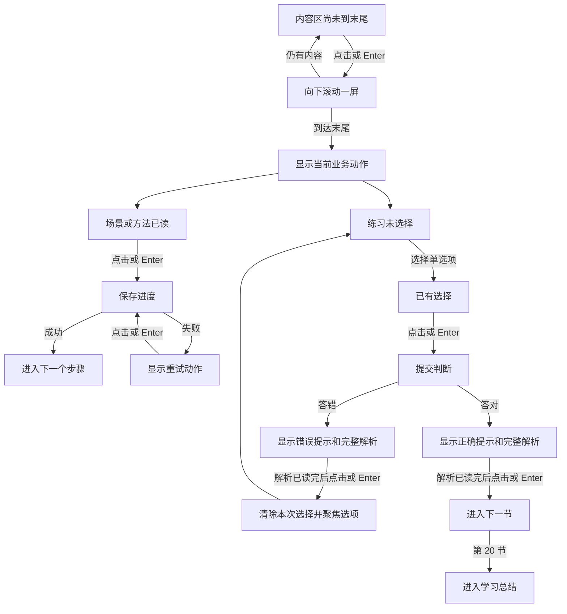
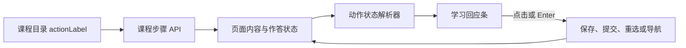

# 在线课程对话式行动条迭代方案

> 版本：V1.2
> 日期：2026-08-03
> 状态：已确认并完成实施，验证通过
> 适用范围：GEO 实战训练营 20 节课程，场景、方法、练习共 60 个学习步骤

## V1.1 Review 修订摘要

| Review 发现                                         | V1.1 修订                                                                      |
| --------------------------------------------------- | ------------------------------------------------------------------------------ |
| 测试集中在最后一批提交，前两批无法独立合并          | 每一批行为改动同步提交对应测试，最后一批只做文档同步和全量复核                 |
| 保存和提交的重试没有规定幂等键复用                  | 同一次动作的网络重试复用原操作 ID，修改答案后生成新操作 ID                     |
| 答错解析出现后仍可能直接修改选项                    | 反馈阅读阶段锁定选项，点击回应条后再进入纠正状态                               |
| 新增步骤文案字段漏掉端到端模拟数据                  | 把 `tests/e2e/course.fixtures.ts` 纳入实施范围                                 |
| 快捷键监听范围过大                                  | 键盘事件只在右侧学习屏幕内生效，顶部账户区和左侧大纲不受影响                   |
| A 至 D 快捷键扩大了需求范围，也与原课程键盘规范冲突 | 练习继续使用原生单选组的 Tab、方向键和 Space，只新增 Enter 主动作              |
| 小屏或文字放大时，Enter 可能跳过未读内容            | 增加内容末尾保护，存在内部滚动时先执行“继续往下看”                             |
| 第一页的 `previousHref` 实际指向学习中心            | 第一页显示“返回学习中心”，其余步骤显示“回看上一步”                             |
| 按钮状态播报和反馈播报可能重复                      | 按钮可读名称只保留主文案，快捷键使用 `aria-keyshortcuts`，反馈通过单一通道播报 |
| 缺少可直接执行的验证命令                            | 增加合同、单元、端到端、类型、格式和构建命令                                   |

## V1.2 实施复查修订摘要

| 实施复查发现                             | V1.2 修复                                                                    |
| ---------------------------------------- | ---------------------------------------------------------------------------- |
| 手机和平板端关闭的大纲仍可进入键盘焦点   | 关闭态增加 `inert`，打开态使用模态语义、焦点循环、遮罩关闭和 Escape 返回焦点 |
| 步骤切换时短暂出现无效的“继续往下看”     | 页面绘制前重置滚动位置并完成内容高度测量                                     |
| 练习反馈出现后可能短暂开放后续动作       | 反馈滚动、焦点和末尾状态在页面绘制前同步完成                                 |
| 滚动事件重复写入相同状态                 | 提取可测试的视口计算函数，相同状态不触发重复更新                             |
| 相同操作 ID 可以携带不同答案             | 服务端校验练习键和选项一致性，冲突请求返回确定错误                           |
| 并发重试可能命中数据库唯一约束并返回异常 | 捕获幂等键唯一冲突，回读已记录作答并按原结果继续                             |

## 一、方案结论

课程学习屏幕底部改为一条全宽的“学习回应条”。它用学员口吻表达当前唯一主动作，支持鼠标点击和 `Enter` 键触发。

本轮采用以下六项设计决定：

1. 移除底部并列的“上一步、进度、下一步”三栏结构。
2. 底部只保留一个全宽主按钮，文案随课程内容和作答状态变化。
3. “回看上一步”移动到标题区的低优先级链接；课程大纲继续承担跨节回看。
4. 练习使用分段式 Enter：第一次提交答案，解析完整可见后再按一次执行纠正或进入下一节。
5. 20 节的场景和方法步骤使用独立文案；提交、错误、成功、保存失败等系统状态使用统一文案。
6. 内容出现内部滚动时，回应条先帮助学员抵达内容末尾，再开放提交或前进动作。

这次迭代不改变 16:10 学习屏幕、不增加数据库字段、不引入新依赖，也不改变课程完成、评价和结业规则。

### 范围

- 统一场景、方法和练习的底部主动作。
- 增加逐节文案、Enter 行为、内容末尾保护、反馈纠正状态和焦点管理。
- 更新合同、课程目录、端到端模拟数据、测试和两份既有课程方案。
- 实施预计涉及 13 个文件，其中新增 4 个文件、增加 1 个向后兼容的响应字段，不增加服务和数据库迁移。

### 范围外

- 教师头像、逐句聊天气泡和真实聊天记录。
- 自动计时跳转、语音指令和语音播报。
- 学员自定义快捷键。
- 后台可视化课程文案编辑器。
- 评价、结业凭证和课程入口的功能调整。

### 承重假设

方案以“解析需要独立阅读”为前提。解析完整可见后，使用下一次点击或 Enter 进入下一节。如果希望提交正确答案后立即跳页，需要同时放弃独立解析阅读阶段，并重新确认此前“答对和答错都展示详细分析”的教学要求。

## 二、现状判断

### 2.1 当前问题

实施前学习页存在三组动作：

- 底部左侧“上一步”。
- 底部右侧“下一步”或“下一节”。
- 练习卡内部“提交答案”或“重新提交”。

这些动作曾分散在两个区域，学员需要反复寻找下一次操作。按钮文案只描述页面跳转，缺少对当前内容的回应感。底部大面积的左右按钮也会压缩学习内容的可视高度。

实施前代码只定义了“Enter 提交当前选择”，以下情况已在 V1.2 中形成确定规则：

- 场景页和方法页如何使用 Enter。
- 未选择答案时按 Enter 的结果。
- 请求保存过程中连续按 Enter 的结果。
- 答错后按 Enter 的结果。
- 答对并出现解析后按 Enter 的结果。
- 输入法正在组词时按 Enter 的结果。
- 焦点位于按钮、链接或输入框时如何防止重复触发。

### 2.2 参考图提炼

参考图最值得复用的特征有三项：

- 底部只有一个宽幅动作，视觉焦点清晰。
- 按钮文案像学员对学习引导者的直接回应。
- 动作位置固定，内容变化时无需重新寻找按钮。

本方案沿用 Orosaga 当前课程蓝、纸面白和深墨色体系。参考图的结构和节奏会保留，品牌标识、圆角和字体继续使用现有系统规范。

## 三、目标与验收标准

### 3.1 产品目标

- 学员看完任何一个步骤后，1 秒内能判断下一次动作。
- 点击与 Enter 执行完全一致的业务动作。
- 一次按键只改变一个学习状态。
- 练习解析拥有独立阅读阶段。
- 存在内部滚动时，学员抵达内容末尾后才能保存、提交或进入下一节。
- 学习回应条始终位于 16:10 学习屏幕内，不引发页面级上下滚动。
- 手机端保留同一套文案和状态，主要交互使用触摸点击。

### 3.2 完成标准

| 验收项     | 完成标准                                                    |
| ---------- | ----------------------------------------------------------- |
| 主动作数量 | 屏幕底部始终只有一个主按钮                                  |
| 文案       | 场景和方法共 40 条内容化文案全部配置完成                    |
| 键盘       | 场景、方法、练习、反馈、失败和完成状态均有确定的 Enter 行为 |
| 练习反馈   | 首次 Enter 只提交，结果出现后需要新的 Enter 才执行后续动作  |
| 防重复     | 保存和提交期间连续按键不会产生重复请求                      |
| 内容末尾   | 内部内容尚未读完时，点击或 Enter 只滚动到内容末尾           |
| 布局       | 1280、1024、768、390、320 px 下按钮不溢出、不遮挡内容       |
| 无障碍     | 可见焦点、可读按钮名、快捷键信息和状态播报完整              |
| 回看       | 标题区可回看上一步，大纲可访问已解锁小节                    |
| 兼容       | 课程进度、刷新恢复、评价和结业页面行为保持一致              |

## 四、页面布局

### 4.1 桌面与平板

```text
┌──────────────────────────────────────────────────────────┐
│ 第 5 节 · 场景             回看上一步   约 16 分钟      │
│                                                          │
│ 标题、说明、场景、方法、模型或练习内容                   │
│                                                          │
├──────────────────────────────────────────────────────────┤
│ 现场我看懂了，看看监测问句                     Enter ↵  │
└──────────────────────────────────────────────────────────┘
```

布局规则：

- 学习回应条位于 16:10 学习屏幕的第二行，内容区继续占据第一行。
- 回看入口放入顶部元信息右侧，样式为文字链接。第一步显示“返回学习中心”，其余步骤显示“回看上一步”。
- 底部不再显示 `5 / 20 节`。左侧大纲已有课程进度，顶部已有当前节和步骤信息。
- 回应条不覆盖内容，不使用悬浮阴影，不固定到浏览器窗口底部。
- 保存或提交期间移除顶部回看入口的 `href`，渲染为 `aria-disabled="true"` 的同尺寸文字，避免请求完成后再次触发导航。

### 4.2 手机

- 回应条宽度占满学习内容区，最小高度 52 px。
- `Enter ↵` 提示在宽度小于 560 px 时隐藏。按钮可读名称始终只包含主文案。
- “回看上一步”保留在顶部元信息区。
- 宽度小于 560 px 时隐藏预计时长，优先保留当前步骤和回看入口。
- 底部加入 `env(safe-area-inset-bottom)`，避免被系统手势区域覆盖。
- 触摸操作使用按钮，连接实体键盘时仍可使用 Enter。

### 4.3 内容末尾保护

桌面目标尺寸下优先让内容完整放入学习屏幕。小屏、文字放大或解析内容较长时，右侧内容区允许内部滚动，页面主体仍保持固定。

- 当 `scrollHeight - scrollTop - clientHeight` 大于 8 px，回应条显示“继续往下看”。
- 点击或按 Enter 后，内容区向下滚动 `clientHeight - 48 px`，保留 48 px 上下文衔接。同一次操作不保存、不提交，也不导航。
- 到达末尾后，回应条切换为逐节文案或练习状态文案。
- 练习反馈较长时显示“继续看完整解析”，抵达末尾后才显示“重新选择”或“进入下一节”。
- 步骤切换、反馈出现和容器尺寸变化时重新计算。滚动动画尊重 `prefers-reduced-motion`；滚动动作在 `scrollend` 或到达目标位置后解锁，不使用固定等待时间。实现使用浏览器原生滚动事件和 `ResizeObserver`，不增加依赖。

## 五、核心状态机



关键规则：

- 第一次 Enter 触发提交，返回结果后按钮文案和动作才会改变。
- 解析无需滚动时，答对后的第二次 Enter 进入下一节，答错后的第二次 Enter 回到选项区。
- 解析需要滚动时，Enter 每次向下滚动一屏；到达末尾后的下一次按键才执行纠正或进入下一节。
- 答错和答对的反馈阅读阶段都锁定选项，抵达解析末尾后才开放后续动作。
- 按住 Enter 产生的重复键盘事件全部忽略。
- 保存中和提交中不接受新的主动作。

## 六、全局按钮文案

### 6.1 内容步骤与保存状态

| 状态           | 主文案                   | 右侧快捷提示 | 点击或 Enter 行为      | 按钮状态       |
| -------------- | ------------------------ | ------------ | ---------------------- | -------------- |
| 内容尚未到底   | `继续往下看`             | `Enter ↵`    | 向下滚动一屏           | 可用           |
| 场景可继续     | 使用逐节内容文案         | `Enter ↵`    | 保存当前步骤并进入方法 | 可用           |
| 方法可继续     | 使用逐节内容文案         | `Enter ↵`    | 保存当前步骤并进入练习 | 可用           |
| 正在保存       | `正在记录这一页…`        | 隐藏         | 等待服务端结果         | 禁用，显示进度 |
| 保存失败       | `记录失败，点这里重试`   | `Enter ↵`    | 重试同一次完成动作     | 可用           |
| 已完成步骤恢复 | `这一页已完成，继续学习` | `Enter ↵`    | 直接进入下一步         | 可用           |

### 6.2 练习状态

| 状态           | 主文案                         | 辅助提示                   | 点击或 Enter 行为          | 按钮状态       |
| -------------- | ------------------------------ | -------------------------- | -------------------------- | -------------- |
| 题目尚未读完   | `继续往下看`                   | `Enter ↵`                  | 向下滚动一屏               | 可用           |
| 未选择         | `先选一个答案`                 | `Tab 进入选项，方向键切换` | 不提交，选项组保持可用     | 禁用           |
| 首次已选择     | `提交我的判断`                 | `Enter ↵`                  | 提交当前答案               | 可用           |
| 正在提交       | `正在检查我的判断…`            | 隐藏                       | 等待服务端结果             | 禁用，显示进度 |
| 提交失败       | `提交失败，点这里重试`         | `Enter ↵`                  | 保留选择并重试             | 可用           |
| 解析尚未读完   | `继续看完整解析`               | `Enter ↵`                  | 向下滚动一屏               | 可用           |
| 答错反馈已读完 | `我再想一次，重新选择`         | `Enter ↵`                  | 清除选择，滚动并聚焦选项组 | 可用           |
| 纠正后已选择   | `提交我的新判断`               | `Enter ↵`                  | 提交修正答案               | 可用           |
| 答对反馈       | `解析我读完了，进入下一节`     | `Enter ↵`                  | 进入下一节场景             | 可用           |
| 已完成练习恢复 | `本节已完成，继续下一节`       | `Enter ↵`                  | 进入下一节场景             | 可用           |
| 第 20 节答对   | `这门课我学完了，查看学习总结` | `Enter ↵`                  | 进入课程完成页             | 可用           |
| 第 20 节已恢复 | `查看我的学习总结`             | `Enter ↵`                  | 进入课程完成页             | 可用           |

### 6.3 文案规则

- 使用学员第一人称，例如“我看懂了”“我理解了”“提交我的判断”。
- 先回应当前内容，再说明即将发生的动作。
- 逐节内容文案控制在 12 至 22 个汉字，系统状态文案控制在 6 至 16 个汉字。
- 每条文案包含明确动词：看看、提交、重选、进入、查看或重试。
- 可见文案不再使用孤立的“下一步”“下一节”“完成课程”。
- 状态变化后维持相同字号、行高和按钮高度，避免文字切换引起布局跳动。

## 七、20 节内容化文案

下表是场景步骤和方法步骤的推荐文案。练习步骤使用第六节的全局状态文案。

| 节次 | 课程主题                           | 场景读完后的按钮                 | 方法读完后的按钮                   | 答对并读完解析                 |
| ---- | ---------------------------------- | -------------------------------- | ---------------------------------- | ------------------------------ |
| 01   | 用户已经走进答案入口               | `现场我看懂了，看看四步链路`     | `四步链路我理解了，来做判断`       | `解析我读完了，进入第 2 节`    |
| 02   | AI 如何找到、选择和吸收信息        | `搜索现场清楚了，看看五段链`     | `五段搜索链我理解了，来做判断`     | `解析我读完了，进入第 3 节`    |
| 03   | GEO、SEO 与 AEO 如何协同           | `协同场景清楚了，看看边界`       | `协同边界我理解了，来做判断`       | `解析我读完了，进入第 4 节`    |
| 04   | 结论能走多远，取决于证据           | `证据问题清楚了，看看边界阶梯`   | `证据边界我理解了，来做判断`       | `解析我读完了，进入第 5 节`    |
| 05   | 从泛词走到真实用户问题             | `用户问题清楚了，开始拆问句`     | `监测问句我会拆了，来做判断`       | `解析我读完了，进入第 6 节`    |
| 06   | 把品牌事实变成可靠知识卡           | `事实材料清楚了，看看知识卡`     | `知识卡结构我理解了，来做判断`     | `解析我读完了，进入第 7 节`    |
| 07   | 写出 AI 易理解、易抽取的内容       | `内容任务清楚了，看看答案单元`   | `答案单元我理解了，来做判断`       | `解析我读完了，进入第 8 节`    |
| 08   | 设计可信且适配平台的信源组合       | `信源场景清楚了，看看四层图谱`   | `四层信源我理解了，来做判断`       | `解析我读完了，进入第 9 节`    |
| 09   | 建立从结果到过程的指标树           | `指标问题清楚了，看看指标树`     | `四层指标树我理解了，来做判断`     | `解析我读完了，进入第 10 节`   |
| 10   | 让采集结果可以复现                 | `采集问题清楚了，看看采样方法`   | `多轮采样我理解了，来做判断`       | `解析我读完了，进入第 11 节`   |
| 11   | 从相关变化走到可信归因             | `归因难点清楚了，看看证据阶梯`   | `归因证据我理解了，来做判断`       | `解析我读完了，进入第 12 节`   |
| 12   | 把诊断变成可执行优先级             | `诊断问题清楚了，看看优先级`     | `优先级矩阵我理解了，来做判断`     | `解析我读完了，进入第 13 节`   |
| 13   | 接住项目：从销售交接到首周计划     | `交接现场清楚了，看看首周路径`   | `首周路径我理解了，来做判断`       | `解析我读完了，进入第 14 节`   |
| 14   | 让问题、知识和任务进入同一条生产线 | `生产问题清楚了，看看完整管道`   | `生产管道我理解了，来做判断`       | `解析我读完了，进入第 15 节`   |
| 15   | 从 Card Pack 到可投母稿            | `母稿任务清楚了，看看审核门`     | `五道审核门我理解了，来做判断`     | `解析我读完了，进入第 16 节`   |
| 16   | 从发布回链到引用追踪               | `发布现场清楚了，看看追踪状态`   | `引用状态机我理解了，来做判断`     | `解析我读完了，进入第 17 节`   |
| 17   | 把结果回流到下一轮                 | `回流场景清楚了，看看验证闭环`   | `验证闭环我理解了，来做判断`       | `解析我读完了，进入第 18 节`   |
| 18   | 和客户讲清目标、波动与边界         | `客户问题清楚了，看看沟通漏斗`   | `沟通漏斗我理解了，来做判断`       | `解析我读完了，进入第 19 节`   |
| 19   | 守住白帽、隐私与异常处理边界       | `风险场景清楚了，看看恢复链`     | `风险恢复链我理解了，来做判断`     | `解析我读完了，进入第 20 节`   |
| 20   | 综合实战：完成 90 天 GEO 作战包    | `实战任务清楚了，打开综合工作台` | `综合工作台我理解了，完成最后判断` | `这门课我学完了，查看学习总结` |

### 7.1 文案存放方式

内容化文案跟随课程目录管理：

- `CourseLessonDefinition` 增加 `storyActionLabel` 和 `modelActionLabel`，分别保存场景和方法文案。
- `courseStepFor` 把对应文案映射为步骤响应中的 `actionLabel`，练习步骤返回统一基础文案“提交我的判断”。
- 前端状态解析器只负责选择内容文案或系统状态文案。
- 重试、加载、答错和答对等系统文案集中放在一个前端配置对象中。

这样能让后续课程版本直接修改内容文案，同时保持 Enter 规则和视觉组件稳定。

## 八、点击与键盘规则

### 8.1 Enter 行为表

| 页面状态       | Enter 结果                 |
| -------------- | -------------------------- |
| 内容尚未到底   | 向下滚动一屏               |
| 场景可继续     | 保存并进入方法             |
| 方法可继续     | 保存并进入练习             |
| 练习未选择     | 无动作，选项区保持焦点提示 |
| 练习已选择     | 提交答案                   |
| 保存或提交中   | 无动作                     |
| 解析尚未到底   | 向下滚动一屏               |
| 答错解析已读完 | 清除本次选择，回到选项区   |
| 纠正答案已选择 | 提交新答案                 |
| 答对解析已读完 | 进入下一节                 |
| 第 20 节答对   | 进入学习总结               |
| 请求失败       | 重试刚才的动作             |

### 8.2 练习选项的键盘操作

- 使用 Tab 进入原生单选组。
- 使用方向键切换选项，使用 Space 选择当前选项。
- 选中后回应条立即从“先选一个答案”切换为“提交我的判断”。
- 纠正阶段选中后切换为“提交我的新判断”。
- 本轮不增加字母或数字选项快捷键，避免与既有课程键盘规范和浏览器操作产生新的冲突。
- 旧方案中的 `Alt + ArrowRight` 前进规则由 Enter 取代，`Alt + ArrowLeft` 保留浏览器历史行为，不由课程页面接管。

### 8.3 防误触规则

Enter 监听绑定在右侧 `.course-lesson-main` 学习屏幕，随页面卸载自动清理。顶部账户区、左侧大纲和页面外部不进入监听范围。

以下情况不触发学习 Enter：

- 事件已经被其他控件处理，即 `event.defaultPrevented` 为真。
- `event.isComposing` 为真，说明中文输入法仍在组词。
- 按住 Enter 产生 `event.repeat`。
- 同时按下 Ctrl、Command、Alt 或 Shift。
- 焦点位于文本输入框、多行输入框、下拉框、链接或其他按钮。单选按钮除外。
- 课程大纲抽屉或对话框处于打开状态。
- 当前动作正在保存、提交或导航。

按钮自身获得焦点时使用浏览器原生 Enter 和 Space 行为，学习屏幕监听不重复执行。只有动作实际执行时才调用 `preventDefault()`。

### 8.4 焦点与播报

- 提交后把焦点移到反馈标题，屏幕阅读器先读“答对了”或“再想一想”。
- 反馈阅读阶段锁定单选组，避免解析尚未读完时直接改答案。
- 答错后再次 Enter，把焦点移到第一个选项，并清除旧选择。
- 首次进入和步骤切换后把焦点移到新步骤标题。
- 可执行按钮增加 `aria-keyshortcuts="Enter"`，按钮可读名称只使用主文案，右侧键帽标记为装饰内容。
- 回应条使用 `<div role="group" aria-label="本步学习操作">`，主动作使用原生 `<button>`，不继续使用导航语义。
- 隐藏状态区只播报保存、提交和失败状态；答题反馈通过获得焦点的反馈标题播报，避免同一结果被重复朗读。
- 加载状态增加 `aria-busy="true"`，失败信息使用 `role="alert"`。
- 禁用状态使用原生 `disabled`，旁边保留可见原因，并通过 `aria-describedby` 建立关联。

## 九、视觉规格

### 9.1 学习回应条

| 属性           | 桌面与平板         | 手机               |
| -------------- | ------------------ | ------------------ |
| 宽度           | 内容区 100%        | 内容区 100%        |
| 高度           | 56 px              | 52 px              |
| 圆角           | 12 px              | 12 px              |
| 左右内边距     | 22 px              | 18 px              |
| 主文案         | 16 px，700         | 15 px，700         |
| 快捷键提示     | 12 px，700         | 视觉隐藏           |
| 顶部分隔       | 1 px `var(--line)` | 1 px `var(--line)` |
| 条与分隔线间距 | 12 px              | 10 px              |

桌面回应条占用高度控制在 69 px。当前底栏由 16 px 上间距、16 px 上内边距、1 px 分隔线和至少 44 px 按钮组成，约占 77 px；新结构可为内容区释放约 8 px。主文案使用绝对居中的独立层，右侧键帽不挤压文字中心线。

### 9.2 色彩与状态

- 可用状态：课程蓝 `var(--blue)` 背景，白色文字。
- 悬停状态：背景加深，整体上移 1 px。
- 按下状态：缩放至 0.995，持续 100 ms。
- 禁用状态：浅灰背景、深灰文字，保持足够对比度。
- 加载状态：左侧显示 16 px 进度图标，按钮宽高保持不变。
- 快捷键显示为半透明白色小键帽，与主文案保持同一基线。
- 正确和错误颜色继续出现在解析卡中，回应条保持统一课程蓝，减少状态色竞争。
- 键盘焦点使用 2 px 白色内圈和 3 px 课程蓝外圈。

### 9.3 动效

- 文案切换使用 150 ms 透明度变化。
- 页面切换继续使用现有 160 ms 淡入与轻微位移。
- 按钮所有状态共用固定高度，文案变化不引起内容区抖动。
- `prefers-reduced-motion: reduce` 下关闭位移、缩放和旋转，仅保留即时状态变化。

## 十、实施设计

### 10.1 数据与组件职责

| 文件                                           | 计划变更                                            |
| ---------------------------------------------- | --------------------------------------------------- |
| `apps/api/src/course/course-catalog.ts`        | 配置 40 条逐节文案，并让三类步骤返回 `actionLabel`  |
| `packages/contracts/src/course.ts`             | 增加长度为 1 至 40 的必填 `actionLabel` 字段        |
| `apps/web/src/course/course-action.ts`         | 新增纯状态解析器，输出文案、动作、禁用原因和快捷键  |
| `apps/web/src/course/CourseActionDock.tsx`     | 新增学习回应条组件，处理视觉、语义和点击            |
| `apps/web/src/course/CourseWorkspacePage.tsx`  | 接入统一动作、内容末尾保护、幂等键和键盘作用域      |
| `apps/web/src/styles/course.css`               | 增加回应条样式，调整顶部回看链接和响应式状态        |
| `packages/contracts/src/contracts.test.ts`     | 覆盖 `actionLabel` 合同校验                         |
| `apps/api/src/course/course-catalog.test.ts`   | 用公开合同校验 60 个步骤，并检查 40 条逐节文案      |
| `apps/web/src/course/course-action.test.ts`    | 覆盖动作、内容末尾、文案、禁用和重试决策            |
| `tests/e2e/course.fixtures.ts`                 | 为模拟步骤补齐 `actionLabel`，记录请求次数和操作 ID |
| `tests/e2e/course.spec.ts`                     | 更新按钮定位，新增键盘、纠正、恢复和响应式流程      |
| `docs/ONLINE-COURSE-UI-INTERACTION-DESIGN.md`  | 用学习回应条和新键盘规则替换旧底栏描述              |
| `docs/ONLINE-COURSE-UPGRADE-EXECUTION-PLAN.md` | 将 `CourseBottomNav` 更新为 `CourseActionDock`      |

`apps/api/src/course/course.service.ts` 继续透传 `courseStepFor` 的结果，不需要新增接口或服务层改动。

本次不依赖新的第三方服务、API 密钥、环境变量、CLI 或账户权限。

### 10.2 动作解析器边界

纯状态解析器接收步骤类型、完成状态、选择答案、作答结果、请求状态、错误状态、内容是否到达末尾和当前节次。它只返回以下信息：

- 可见文案和辅助提示。
- 动作类型：滚动、完成步骤、提交答案、重新选择、导航或重试。
- 按钮是否禁用及禁用原因。
- 是否展示 Enter 键帽和 `aria-keyshortcuts`。

解析器不直接读取 DOM、不发请求，也不执行导航。滚动测量、请求和导航由 `CourseWorkspacePage` 处理，`CourseActionDock` 只渲染解析结果并上报点击。

### 10.3 请求幂等与执行锁

- 场景或方法开始保存时生成一次操作 ID，请求失败后的重试复用该 ID，成功或离开步骤后清除。
- 每次练习提交生成一个操作 ID。同一选择发生网络重试时复用，进入重新选择状态并修改答案后生成新 ID。
- 请求发出前设置同步执行锁，React 状态更新前的连续点击和连续 Enter 也只能进入一次请求。
- 请求完成、失败或组件卸载时按对应状态释放执行锁。
- 端到端测试同时断言请求次数和操作 ID，避免只根据界面结果判断防重复是否生效。

### 10.4 数据流



### 10.5 实施顺序

#### 提交 A：统一点击动作

- 增加 40 条内容化文案和合同字段。
- 建立动作状态解析器与学习回应条。
- 移除旧底栏和练习卡内的提交按钮。
- 增加内容末尾保护、请求执行锁和稳定操作 ID。
- 更新合同、目录、动作解析器、模拟数据、点击流程和视觉测试。
- 将“回看上一步”移动到顶部元信息区。

这一提交完成后，鼠标和触摸体验完整，相关测试通过，可以独立合并和回退。

#### 提交 B：键盘学习节奏

- 增加 Enter 状态规则。
- 增加输入法、组合键、焦点和重复按键保护。
- 加入结果焦点管理和状态播报。
- 同步提交动作解析器单元测试和键盘端到端测试。

这一提交完成后，键盘和点击拥有一致结果，所有验证仍保持通过；需要回退时可以单独关闭学习屏幕键盘监听。

#### 提交 C：全量检查与文档同步

- 更新现有 UI 方案与升级计划中关于旧底栏的描述。
- 在 1280、1024、768、390、320 px 下执行全量复核。
- 运行合同、单元、端到端、类型、格式和构建门禁，记录实际结果和遗留项。

这一提交只修改文档和验收记录，前两批提交已经各自满足可合并条件。

## 十一、测试与 Review 清单

### 11.1 单元与合同测试

- [x] 40 条场景与方法文案全部存在。
- [x] 每条文案在长度上限内，首尾没有空格。
- [x] 60 个课程步骤全部通过 `courseStepSchema` 校验。
- [x] 每个动作状态只映射到一个业务动作。
- [x] 内容未到底时只能得到滚动动作。
- [x] 第 20 节使用学习总结文案和完成页地址。
- [x] 保存和提交中返回禁用状态。
- [x] 答错状态返回“重新选择”，不会重复提交旧答案。
- [x] 答对状态返回“进入下一节”。
- [x] 完成记录恢复后可直接继续。

### 11.2 全流程测试

- [x] 从第 1 节场景开始，仅用 Enter 完成场景和方法。
- [x] 内容存在内部滚动时，Enter 每次只向下滚动一屏。
- [ ] 用 Tab、方向键和 Space 选择答案，再用 Enter 提交。
- [x] 故意答错后看到完整解析。
- [x] 答错解析出现后选项保持锁定。
- [ ] 答错后按 Enter 回到选项，再次选择并提交。
- [x] 答对后停留在解析页，新的 Enter 进入下一节。
- [ ] 按住 Enter 不产生重复提交或跨过两个页面。
- [x] 同一动作发生网络重试时复用操作 ID，修改答案后使用新操作 ID。
- [x] 保存失败和提交失败时可点击或按 Enter 重试。
- [ ] 刷新已完成的场景、方法和练习后可继续。
- [x] 第 20 节答对后进入学习总结、评价与凭证规则页面。
- [ ] 鼠标点击路径与键盘路径的课程进度完全一致。

### 11.3 输入与无障碍测试

- [ ] 中文输入法组词期间 Enter 不触发课程动作。
- [ ] 焦点位于账户菜单、链接和文本输入框时不触发学习动作。
- [ ] 按钮聚焦时 Enter 只执行一次，Space 也可激活。
- [ ] 屏幕阅读器能读出当前动作和快捷键。
- [x] 结果出现后焦点顺序符合阅读顺序，同一结果只播报一次。
- [ ] 颜色对比度达到 WCAG AA。
- [ ] 减少动态效果设置生效。

### 11.4 视觉与布局测试

- [x] 16:10 学习屏幕比例保持不变。
- [x] 回应条始终位于学习屏幕内。
- [x] 页面级无横向和纵向滚动回归。
- [ ] 最长文案在 1024 px 桌面下不换行。
- [ ] 320 px 手机下主文案保持单行，快捷键提示自动隐藏。
- [ ] 200% 文字缩放时回应条仍可见，未读内容由末尾保护接管。
- [ ] 状态变化时按钮、内容和解析卡不发生明显位移。
- [x] 展开课程大纲和账户菜单时 Enter 不穿透。

### 11.5 验证命令

按以下顺序执行，任何一步失败都先修复再继续：

```bash
npm test -w @orosaga/contracts -- src/contracts.test.ts
npm test -w @orosaga/api -- src/course/course-catalog.test.ts
npm test -w @orosaga/web -- src/course/course-action.test.ts
npx playwright test tests/e2e/course.spec.ts --project=chromium
npm run lint
npm run typecheck
npm run build
```

端到端测试必须至少执行一个非跳过用例，并确认请求断言、键盘路径和响应式布局断言都实际运行。视觉验收同时保留 1280、1024、768、390 和 320 px 的截图证据。

## 十二、风险与处理

| 风险                   | 影响                   | 处理方式                                       |
| ---------------------- | ---------------------- | ---------------------------------------------- |
| 学员连续按 Enter       | 重复请求或跨过内容     | 忽略 `repeat`，同步执行锁配合稳定操作 ID       |
| 中文输入法提交候选词   | 意外切换课程           | 检查 `isComposing` 和输入焦点                  |
| 答对后立即再次按键     | 解析阅读时间过短       | 结果出现后切换焦点，下一次独立按键才前进       |
| 小屏或文字放大产生溢出 | 未读完内容就进入下一步 | 内容末尾保护先执行滚动动作                     |
| 移除大按钮后找不到回看 | 回顾成本增加           | 顶部提供“回看上一步”，大纲保留已解锁内容入口   |
| 个性化文案后续失配     | 课程内容与按钮语义分离 | 文案跟随课程目录定义并加入完整性测试           |
| 长文案挤压快捷键       | 1024 px 下换行         | 设置主文案弹性宽度和省略保护，文案长度进入测试 |
| 键盘监听干扰菜单       | 误触操作               | 监听范围限制在右侧学习屏幕，抽屉打开时暂停     |

## 十三、方案取舍

推荐方案保留一个全宽回应条，以内容化文案、状态解析器和学习屏幕 Enter 组成完整交互。它能同时收拢阅读前进、练习提交、错误纠正和成功继续。

最小改动方案只替换“下一步”文案并增加 Enter。练习卡内部提交按钮和底部前进按钮仍会并存，状态来源继续分散，因此不采用。

提交正确答案后立即跳页可以少一次操作，也会跳过详细解析的独立阅读阶段。本轮保留解析阶段，自动跳页继续放在范围外。教师头像和真实聊天记录需要新增内容角色、素材和会话状态，当前回应条已经能满足这次交互目标。

## 十四、回退方案

本次没有数据库迁移，回退成本较低：

1. 关闭学习屏幕键盘监听，保留点击动作。
2. 先回退前端 `CourseActionDock`，恢复现有底栏和练习卡提交按钮。
3. 再回退课程目录和合同中的 `actionLabel`。旧前端会忽略服务端的额外字段，因此也可以暂时保留该字段。
4. 课程进度、作答记录、评价和完成数据无需转换。

## 十五、确认项

建议按以下默认项整体确认：

- [x] 使用全宽课程蓝学习回应条。
- [x] “回看上一步”放到标题区，大纲继续支持跨节回看。
- [x] 练习第一次 Enter 提交，解析完整可见后的下一次 Enter 进入下一节。
- [x] 答错后的 Enter 执行重新选择。
- [x] 内容出现内部滚动时，Enter 先执行“继续往下看”。
- [x] 练习选项继续使用原生 Tab、方向键和 Space 操作。
- [x] 采用“20 节内容化文案”表中的 40 条按钮文案。
- [x] 第 20 节结束后进入现有学习总结和评价流程。

本方案已经按第十节范围完成实施，V1.2 复查结果和验证状态已写回本文件。
